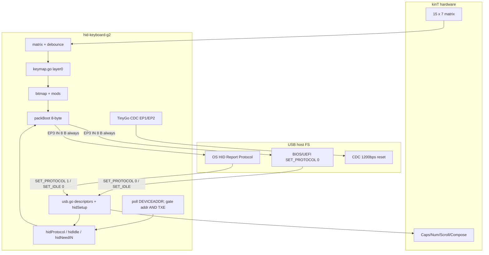
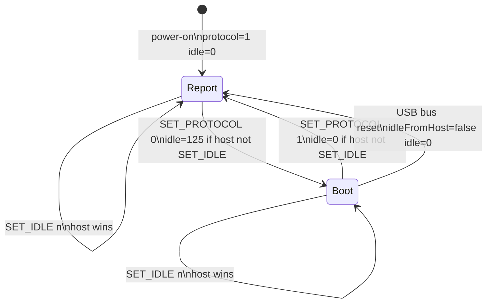
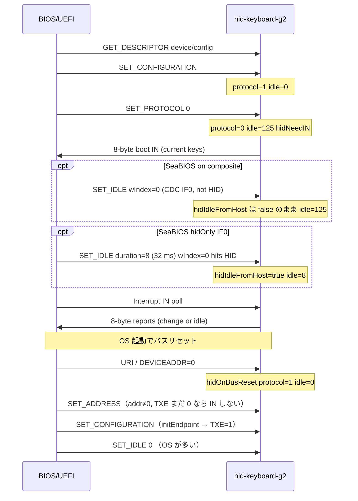

# kinT TinyGo HID キーボード設計（Goal 2: HID Boot Protocol）

| 項目 | 内容 |
| --- | --- |
| 文書タイトル | kinT + Teensy 4.1 TinyGo HID キーボード（Goal 2: Boot Protocol） |
| 著者 | TBD |
| 日付 | 2026-09-20 |
| ステータス | Draft |
| 対象ディレクトリ | `hid-keyboard-g2/` |
| 対象ハードウェア | [kinT (kint41)](https://github.com/kinx-project/kint) = Kinesis Advantage コントローラ置換 + Teensy 4.1 (MIMXRT1062) |
| 前提 | Goal 1 実装・実機検証済み（`hid-keyboard-g1/`）。設計は [`hid-keyboard-g1/design.md`](../hid-keyboard-g1/design.md) |

本設計のスコープは **Goal 2: HID Boot Protocol を仕様どおり動かす** である。USB スタックの組み直し、ディスクリプタの Boot subclass 化、8 バイト IN、`SET_PROTOCOL` の ACK は Goal 1 で済んでいる。Goal 2 は **Boot 時の挙動**（idle、リセット後の Report 復帰、BIOS/UEFI 実地）である。USB High Speed は Goal 3。

`hid-keyboard-g2/` の Go ソースは現在 Goal 1 のコピーである。本設計の実装は後続タスクで同ディレクトリに入れる。`hid-keyboard-g1/` のコードと `design.md` は書き換えない。

---

## Overview

Goal 1 は CDC + HID Boot Keyboard 複合デバイスとして列挙し、Report ID なし 8 バイト IN を常に送り、`SET_PROTOCOL` / `GET_PROTOCOL` を ACK して値を保持する。ただし `packReport` は `hidProtocol` を無視し、電源投入 default は `hidIdle=0`（変化時のみ）、USB バスリセット後もアプリの protocol/idle は戻らない。

Goal 2 は HID 1.11 の Boot Keyboard 要件を満たす:

1. IN パケットは Boot も Report も Appendix B の 8 バイトのまま（`packReport` は `protocol` で分岐しない）。観測できる「honor」は idle default、リセット後の Report 復帰、`GET_PROTOCOL`、BIOS 実地である。
2. Boot 中でホストが `SET_IDLE` していないとき、idle default を **125（500 ms）** にする（HID 7.2.4 推奨）。Report 中は 0。EDK2 のキーホールドには不要（自前タイマ）。SeaBIOS のリピートは受信レポート間隔に依存するが、複合デバイスでは `SET_IDLE` が HID に届かない（後述）。
3. USB リセット後は HID 7.2.6 / Appendix F.3 どおり **Report Protocol** に戻す。検出は `USB1.DEVICEADDR` の非0→0。IN の prime は **`DEVICEADDR==0` または `ENDPTCTRL3.TXE==0` なら禁止**（同一ティックの URI は addr、SET_ADDRESS〜SET_CONFIGURATION は TXE）。
4. BIOS/UEFI（SeaBIOS / EDK2 / macOS EFI）でキーボードが使えることを検証する。

NKRO・USB HS・PID 変更・キーマップ変更はしない。CDC は残す（失敗したらコンパイル時 `hidOnly`）。HID class descriptor 単独 GET（type `0x21`）は TinyGo `sendDescriptor` が ZLP を返す既知ギャップで、BIOS で観測されるまでパッチしない。

---

## Background & Motivation

### Goal 1 が既に提供するもの

| 項目 | 状態（`hid-keyboard-g2/` コピー時点） |
| --- | --- |
| `machine.ConfigureUSBEndpoint`、`keyboard.Port()` 不使用 | 済み（`usb.go` `init()`） |
| IF2 HID Boot subclass=1 / protocol=1 | 済み |
| EP3 IN/OUT Interrupt、`wMaxPacketSize=8`、`bInterval=1` | 済み |
| Report descriptor: Appendix B.1、Report ID なし、LED 5 bit | 済み |
| `hidSetup`: GET/SET_REPORT, GET/SET_IDLE, GET/SET_PROTOCOL | ACK 済み |
| `packReport` | `protocol` を無視して `packBoot`。常に 8 バイト |
| `hidProtocol` 初期値 | `protocolReport`（1）。HID Appendix F |
| `hidIdle` 初期値 | 0（変化時のみ） |
| キーマップ | `keymap.go`（QMK `default_pretty` / my-customize） |
| VID:PID | `16C0:0483`、CDC 共存、1200 bps リセット |

Goal 1 設計が Goal 2 に明示的に渡したもの:

- Boot subclass を Goal 1 から名乗る（OS 認識を Goal 2 で変えない）
- 8 バイトは Goal 2 でも同じパケット
- `packReport(protocol)` シグネチャ
- USB リセット後の protocol/idle は TinyGo ギャップとして未処理
- Boot 時 idle 125 を検討
- CDC 拒否 BIOS は Goal 2 で決める
- NKRO は Goal 2 オプション

### なぜ Goal 1 のままでは Boot として足りないか

ホストが `SET_PROTOCOL(0)` しても、送出経路は既に 8 バイトなので **形状は合っている**。不足は次の 3 点である。

1. **Idle。** HID 7.2.4 はキーボードの推奨 default を 500 ms（duration 125）とする。HID Appendix F.3 は Boot Keyboard に「変化が無くても Interrupt IN を返す。`SET_IDLE` がこれを上書きする」と書く。Goal 1 の `hidIdle=0` は macOS/Linux の OS リピート向けで正しい。ホスト別:
   - **EDK2 `UsbKbDxe`:** `UsbSetProtocolRequest(BOOT)` のみ。`SET_IDLE` は送らない。`KeyboardHandler` は 8 バイトが `LastKeyCodeArray` と同じなら即 return。リピートは EFI タイマ `USBKeyboardRepeatHandler`。idle 125 の重複 IN は無視される。**ホールド維持に 500 ms 再送は不要。** 125 は仕様 default として入れる。
   - **SeaBIOS:** `SET_PROTOCOL(0)` は `wIndex=bInterfaceNumber`（IF2、HID に届く）。`SET_IDLE(33 ms)` は **`wIndex=0` 固定** で、複合デバイスでは CDC ACM に行く。TinyGo `cdcSetup` は未知の host-to-device class を `SendZlp` 無しで `true` 返すため status がタイムアウトし、`hidIdleFromHost` は false のまま。SeaBIOS は SET_IDLE 失敗を warning にしてキーボード初期化は続ける。リピートは受信レポートごとに `repeatcount` を減らす（`KEYREPEATWAITMS/KEYREPEATMS+1 ≈ 16`）。idle 125 だと初回リピートまで約 8 s。複合のままでは SeaBIOS の 33 ms idle は **honor できない**。
   - **Linux/macOS usbhid:** 多くは probe で `SET_IDLE(0)` → 変化時のみ（望ましい上書き）。
2. **USB リセット。** HID 7.2.6 / F.3: リセット後は Report Protocol（非 boot）に戻る。BIOS が Boot にしたあと OS がバスリセットして列挙し直す、という遷移で `hidProtocol` が 0 のまま残ると、将来 Report 側のレポート形状を変えたときに OS へ Boot パケットを送り続ける。Goal 2 は 8 バイト固定なので実害は小さいが、仕様違反であり Goal 2 で閉じる。`DEVICEADDR` はリセット **検出** に使う。IN を prime してよいかの信号ではない（`SET_ADDRESS` は `SET_CONFIGURATION` より先）。
3. **BIOS 実地。** 複合 CDC+HID（Device class `0xEF` IAD）、EP 番号 3、HID class GET `0x21` の ZLP、SeaBIOS `SET_IDLE` wIndex=0 は OS では問題にならないことが多い。BIOS はインタフェース走査が雑な実装がある。検証項目として明示する。

### TinyGo USB（#5704 / #5691）の関連事実

参照はローカル TinyGo `src/machine/`。

**フルスピード固定・64 バイト EP**（`machine_mimxrt1062_usb.go`）:

- `PORTSC1.PFSC` で FS 12 Mbps 固定。Goal 2 も FS。HS は Goal 3。
- `SendUSBInPacket` は 64 バイト超を拒否。Boot 8 バイトは問題にならない。
- DMA は 4 KiB 非キャッシュ OCRAM。カスタム DMA 禁止、常に `SendUSBInPacket`。

**バスリセット**（同ファイル `handleUSBIRQ` / `handleUSBBusReset`）:

```
USBSTS.URI → handleUSBBusReset:
  ENDPTSETUPSTAT / ENDPTCOMPLETE を W1C
  ENDPTPRIME 待ち
  転送中 IN を usbTxCancelled に記録
  ENDPTFLUSH = 0xFFFFFFFF
  DEVICEADDR = 0
  usbConfiguration = 0
```

しないこと:

- `USBDev.InitEndpointComplete = false` にしない（STM32 `handleUSBReset` はする）
- `ENDPTCTRL` の TXE/RXE をソフトウェアで落とさない
- アプリコールバックを呼ばない
- `hidProtocol` / `hidIdle` は TinyGo の知らない変数なので当然触らない
- `URI` は `USBSTS` への W1C で IRQ 入口で消える。ファームから URI は読めない

`usbConfiguration` は `machine/usb.go` の非公開変数。アプリから読めない。公開な `USBDev.InitEndpointComplete` は mimxrt ではリセット後も `true` のままなので、設定済み判定にも使えない。

i.MX RT1060 RM 41.5.6.2.1: バスリセット後、**EP0 以外はハードウェアが disable** し、prime 中の転送はキャンセルされる。続く `SET_CONFIGURATION` で TinyGo `initEndpoint` が `ENDPTCTRL3.TXE` を立てる。USB 2.0 の順は URI → SET_ADDRESS（addr 1–127）→ … → SET_CONFIGURATION。`DEVICEADDR != 0` は **まだ未 configure** である。

`SendUSBInPacket` は `usbPrime` が戻れば **true** を返す。`usbPrime` は `ENDPTPRIME` が落ちるまで最大 `usbSpinLimit = 5_000_000` 回 MMIO 待ち（600 MHz で数十〜数百 ms）。EP が disable のまま prime すると 1 ms スキャンが止まる。true のあと `initEndpoint` が dTD を flush すると、そのパケットは消える。これは Goal 1 の busy（`SendUSBInPacket==false`）再試行とは別物である。

**HID class descriptor GET**（`machine/usb.go` `sendDescriptor`）:

- `TypeHIDReport`（`0x22`）は `usbDescriptor.HID[WIndex]` を返す
- `TypeClassHID`（`0x21`）は `default` → `SendZlp()`
- この GET は standard `GET_DESCRIPTOR` なので `hidSetup` には来ない。ファーム単体では直せない

**CDC 1200 bps リセット**（`machine/usb/cdc/usbcdc.go`）:

- `SET_LINE_CODING` で 1200 bps かつ DTR=0 なら `EnterBootloader()`
- ディスクリプタから CDC を消すとホストが ACM を開かず、`tinygo flash` の自動リセットが死ぬ
- PID を変えると `targets/teensy41.json` の `"serial-port": ["16c0:0483"]` と不一致

### BIOS ホストが実際にすること

| ホスト | 識別 | SET_PROTOCOL | SET_IDLE | リピート |
| --- | --- | --- | --- | --- |
| SeaBIOS `usb-hid.c` | subclass Boot + protocol Keyboard。IN `wMaxPacketSize` が 8–16 | 0、`wIndex=iface`（IF2）。失敗したらキーボード初期化失敗 | 33 ms、**`wIndex=0` 固定**（複合では CDC IF0）。失敗は warning のみ | 受信レポートごとに `repeatcount--`。`KEYREPEATWAITMS=500` |
| EDK2 `UsbKbDxe` | class HID + subclass Boot + protocol Keyboard（インタフェース単位。Device class は見ない） | `BOOT_PROTOCOL` | 送らない | EFI タイマ。同一 8 バイト IN は無視 |
| macOS EFI / 起動ピッカー | Boot Keyboard インタフェースを探す | **未検証。** Boot なら 0 を送る想定 | 未検証 | EFI 側想定 |
| Linux usbhid（OS） | Report descriptor を読む | 多くは Report のまま、または 1 | probe でしばしば 0 | OS |

複合 CDC+HID は SeaBIOS / EDK2 とも **インタフェース** を見るので、仕様どおりの BIOS なら IF2 の Boot Keyboard を拾う。Device class `0xEF` しか見ない古い実装と、Interrupt IN が EP1 以外だと無視する実装が失敗モード。

---

## Goals & Non-Goals

### Goals（Goal 2）

1. Boot を「名乗るだけ」にしない。ただし **パケット形状は Goal 1 の 8 バイトのまま**（`packReport` は `protocol` を見ない。シグネチャは将来用に残す）。観測できる意味は idle default、リセット後 Report 復帰、`GET_PROTOCOL` の値、BIOS 実地である。NKRO 分岐は Goal 2 では入れない。
2. Boot 中かつホスト未指定の idle は **125（500 ms 再送）**。Report 中の default は 0。ホスト `SET_IDLE` は常に優先。
3. USB バスリセット後、`hidProtocol=Report`、idle は Report default。検出は DEVICEADDR、IN は `addr!=0 && TXE`。HID 7.2.6 をファームで満たす。
4. BIOS/UEFI および macOS 起動セキュリティ / ファームウェアパスワード / 起動ピッカーでキー入力できる。検証手順を定義する。
5. TinyGo は PR #5704（#5691 USB を含む）のまま。`machine.Flash` は呼ばない。Goal 2 の正しさは TinyGo 追加パッチ無しで成立させる。
6. `machine/usb/hid` と `keyboard.Port()` を import しない。送信は `SendUSBInPacket` のみ。USB は Full Speed。

### Non-Goals

| 項目 | 扱い |
| --- | --- |
| USB High Speed | Goal 3。`PFSC` / 64 バイト EP は触らない |
| NKRO / ビットマップ / Report ID | 入れない。Boot は Report ID 禁止。両方 8 バイト 6KRO |
| キーマップ変更、レイヤ、`MO()` | `keymap.go` は my-customize のまま。`KC_BOOTLOADER` は未マップのまま |
| Vial / VIA / マウス / Consumer / マクロ | 対象外 |
| Windows ホスト | 非目標。Boot 検証が Windows 機の **UEFI** ならそのファームウェア画面は対象 |
| TinyGo への必須パッチ（`0x21` GET、リセットフック） | 観測されるまで出さない。付録に差分だけ書く |
| PID 変更（`1209:345C` 等） | しない。`tinygo flash` を壊さない |
| `-serial uart` | 不可（`initUSB` が走らず HID も死ぬ） |

---

## Proposed Design

### 全体像（Goal 1 からの差分）

USB ディスクリプタ・マトリクス・キーマップ・LED・スキャン周期は Goal 1 と同じ。変わるのは `hid.go` の protocol/idle 政策と、メインループからのバスリセット検出（DEVICEADDR）および IN ゲート（addr==0 **かつ** EP3 TXE）である。



### ファイル配置

全て `package main`。`tinygo flash --target teensy41 ./hid-keyboard-g2`。

```
hid-keyboard-g2/
  design.md      本設計
  main.go        1 ms ループ。usbPollBusReset を呼ぶ
  usb.go         複合ディスクリプタ（Goal 1 と同じ。hidOnly 時だけ分岐）
  hid.go         protocol/idle 政策、packBoot、hidSend
  usbreset.go    DEVICEADDR ポーリング、hidINAllowed（addr かつ TXE）（新規）
  matrix.go      変更なし
  keycode.go     変更なし
  keymap.go      変更なし
  led.go         変更なし
```

新規は `usbreset.go` が基本。`hidOnly` を入れるなら `usb.go` にコンパイル時分岐を足す。マトリクスとキーマップは触らない。

### Boot vs Report: パケットは同じ

HID 1.11 Appendix B.1 Boot Keyboard 入力:

```
byte 0  modifier  LCtrl LShift LAlt LGUI RCtrl RShift RAlt RGUI
byte 1  reserved  0x00
byte 2..7  HID usage 最大 6。空きは 0x00。超過は 6 スロット全て 0x01 ErrorRollOver
```

Goal 1 の report descriptor がこのレイアウトそのものなので、**Report Protocol でも同じ 8 バイト** を送る。Goal 2 で `packReport` が `protocol` を見て分岐してはならない（シグネチャは将来 NKRO 用に残すだけ）。

```go
func packReport(pressed *[32]byte, mods uint8, protocol uint8) [8]byte {
    // Goal 2: Boot も Report も Appendix B 8 バイト。NKRO は入れない。
    _ = protocol
    return packBoot(pressed, mods)
}
```

Boot を「honor」する中身はパケット形状ではなく:

| 項目 | Report (`hidProtocol==1`) | Boot (`hidProtocol==0`) |
| --- | --- | --- |
| IN パケット | 8 バイト `packBoot` | 同じ |
| Report ID | 付けない | 付けない（禁止） |
| idle default（ホスト未 `SET_IDLE`） | 0（変化時のみ） | 125（500 ms） |
| リセット後 | この状態が仕様上の既定 | 禁止。Report に戻す |
| GET_PROTOCOL | 1 | 0 |
| GET_REPORT Input | `hidLastIN` 8 バイト | 同じ |

将来 NKRO を足すなら Report 側だけ Report ID 付きビットマップにし、Boot は 8 バイトのままにする。Boot 中に Report ID を付けてはならない。Goal 2 では足さない。

### Idle 政策

定数:

```go
const (
    protocolBoot   = 0
    protocolReport = 1
    idleReportDef  = 0   // 変化時のみ。OS リピートはホスト側
    idleBootDef    = 125 // 125 * 4 ms = 500 ms。HID 7.2.4 推奨
)
```

状態:

```go
var (
    hidProtocol      uint8 = protocolReport
    hidIdle          uint8 = idleReportDef
    hidIdleFromHost  bool  // SET_IDLE を受けたら true。リセットで false
    hidNeedIN        bool  // プロトコル変更・リセット直後。TXE 付き成功送信でのみ下ろす
)
```

規則:

1. **電源投入:** `protocol=Report`, `idle=0`, `hidIdleFromHost=false`（Goal 1 と同じ。OS が先に列挙する経路を壊さない）。
2. **`SET_IDLE`:** `hidIdle = WValueH`、`hidIdleFromHost=true`。duration 0 も含めホスト指定が常に勝つ。Report ID（`WValueL`）は Goal 1 どおり無視（レポートは 1 本）。
3. **`SET_PROTOCOL`:** `WValueL` が 0 または 1 以外は stall。0/1 なら `hidProtocol` を更新し、**`hidIdleFromHost==false` のときだけ** idle を default に合わせる:
   - Boot → `hidIdle=125`
   - Report → `hidIdle=0`
   - `hidNeedIN=true`（BIOS が直後の IN を待つため、現在キー状態を 1 回出す。既に configure 済みの経路）
4. **USB リセット:** `hidIdleFromHost=false`、`hidProtocol=Report`、`hidIdle=0`、`hidNeedIN=true`、`hidLastINValid=false`、`hidLastIN` を `interrupt.Disable` 下で poison（全 `0xFF`）。IN は `usbDeviceAddr()==0 || !hidEP3InEnabled()` なら prime しない。
5. **`SET_PROTOCOL` は idle を仕様上は変えない。** 3 の default 適用は「Boot に入ったデバイス初期化」として 7.2.4 の 500 ms を遅延適用する実装選択である。ホストがその後 `SET_IDLE` すれば上書きされる。F.3 の「毎 poll IN」は、届いた `SET_IDLE` が上書きするという前提である。複合 + SeaBIOS ではその `SET_IDLE` が HID に届かない。

ホスト別の実際:

| ホスト | 複合 CDC+HID での idle |
| --- | --- |
| SeaBIOS | SET_IDLE は IF0（CDC）。`hidIdleFromHost` は false。Boot のまま 125 → リピート約 8 s。`hidOnly`（HID=IF0）なら 33 ms が届く |
| EDK2 | SET_IDLE なし。ホールドは EFI タイマ。125 は無害 |
| Linux/macOS | 多く SET_IDLE(0)。`hidIdleFromHost=true`。あとの SET_PROTOCOL は idle を変えない |

`hidSend`（1 ms ティック）。**IN ゲートは addr と TXE の AND**（役割が違うので片方では足りない）:

| 条件 | 閉じる穴 |
| --- | --- |
| `usbDeviceAddr()==0` | 同一ティック: ループ先頭の poll のあと URI。TinyGo IRQ が即 `DEVICEADDR=0`。TXE のソフトウェア 0 は次の `usbPollBusReset` まで遅れる |
| `!hidEP3InEnabled()`（TXE==0） | SET_ADDRESS 後〜 SET_CONFIGURATION 前。addr は既に 1–127 |

```go
func hidEP3InEnabled() bool {
    return nxp.USB1.GetENDPTCTRL3_TXE() != 0
}

func hidINAllowed() bool {
    return usbDeviceAddr() != 0 && hidEP3InEnabled()
}

func hidSend(report [8]byte, idleTicks *uint32) {
    if !hidINAllowed() {
        *idleTicks++
        return // usbPrime しない（同一ティック URI の 5e6 スピンも SET_ADDRESS 窓も避ける）
    }
    hidCurrent = report
    changed := hidLastINValid && report != hidLastIN
    idle := hidIdle
    dueIdle := idle != 0 && *idleTicks >= uint32(idle)*4
    if !changed && !dueIdle && !hidNeedIN {
        *idleTicks++
        return
    }
    if !machine.SendUSBInPacket(uint32(usb.HID_ENDPOINT_IN), hidCurrent[:]) {
        // busy（dTD Active）: 次ティックで最新を再試行。hidNeedIN は立てたまま
        ...
        return
    }
    hidNeedIN = false
    hidSendFail = 0
    *idleTicks = 0
    state := interrupt.Disable()
    hidLastIN = hidCurrent
    hidLastINValid = true
    interrupt.Restore(state)
}
```

`hidSendEmpty`（`KC_BOOTLOADER` 直前）も同じ `hidINAllowed()`。`usbPrime` のスピンはアドレス 0 でも TXE 残りでも起こりうる。

`hidNeedIN` は **`hidINAllowed()` が true のときの `SendUSBInPacket==true` でのみ下ろす**。busy 再試行とは別フラグ。`hidLastIN` poison は NeedIN が落ちたときの `changed` 用。GET_REPORT は `hidLastINValid` が false なら 8 ゼロを返す（`0xFF` をファントムキーにしない）。

idle 単位は Goal 1 と同じ: メインループ 1 ms × `hidIdle*4`。ヒープ確保なし、静的 `[8]byte`。

### `hidSetup` の Goal 2 差分

Goal 1 の ACK 配線は維持する。変えるのは `SET_PROTOCOL` / `SET_IDLE` の副作用だけ。

```go
case usb.SET_IDLE:
    hidIdle = setup.WValueH
    hidIdleFromHost = true
    machine.SendZlp()
    return true
case usb.SET_PROTOCOL:
    p := setup.WValueL
    if p != protocolBoot && p != protocolReport {
        return false // EP0 stall
    }
    applyProtocol(p)
    machine.SendZlp()
    return true
```

```go
func applyProtocol(p uint8) {
    hidProtocol = p
    if !hidIdleFromHost {
        if p == protocolBoot {
            hidIdle = idleBootDef
        } else {
            hidIdle = idleReportDef
        }
    }
    hidNeedIN = true
}

func hidOnBusReset() {
    hidIdleFromHost = false
    hidNeedIN = true
    hidProtocol = protocolReport
    hidIdle = idleReportDef
    state := interrupt.Disable()
    hidLastIN = [8]byte{0xFF, 0xFF, 0xFF, 0xFF, 0xFF, 0xFF, 0xFF, 0xFF}
    hidLastINValid = false
    interrupt.Restore(state)
    // RM は URI で EP0 以外を disable すると書く。TinyGo は ENDPTCTRL を触らない。
    // ハードウェアが TXE を残した場合に SET_ADDRESS 窓で prime しないよう、こちらでも落とす。
    nxp.USB1.SetENDPTCTRL3_TXE(0)
}
```

`GET_IDLE` / `SET_REPORT` / Interrupt OUT は Goal 1 のまま。`GET_REPORT` Input は `hidLastINValid` が false なら 8 ゼロ（リセット直後の poison を返さない）。Boot でも Report ID は 0 のみ。

`hidSetup` は USB IRQ（`handleEP0Setup`）から呼ばれる。TinyGo `println` → CDC TX を IRQ 内でやってはならない（確保・`ENDPTPRIME` 待ち・USB 再入）。`SET_PROTOCOL` / `SET_IDLE` は IRQ セーフなカウンタとスナップショットだけ更新する。印刷は 1 ms ループ（`hidLogFromMain`）。

Goal 1 の `debug` はマトリクス座標だった。Goal 2 では分けて、両方とも main からのみ出す:

```go
const debugHID = false    // protocol / idle / bus reset
const debugMatrix = false // press/release r,c（Goal 1 の debug）
```

IRQ 側:

```go
var (
    hidLogProtocol uint8 = 0xFF
    hidLogIdle     uint8 = 0xFF
    hidLogReset    uint32
)

// hidSetup 内（IRQ）: hidLogProtocol = hidProtocol 等。println しない。
```

main:

```go
func hidLogFromMain() {
    if !debugHID {
        return
    }
    // 前回印刷と違えば println("set_protocol", p, "idle", idle)
    // hidLogReset が増えていれば println("usb bus reset", n)
}
```

### USB リセット検出（TinyGo パッチ無し）

IRQ 経路にアプリフックは無い。`usbConfiguration` は非公開。`InitEndpointComplete` は mimxrt では落ちない。`URI` は IRQ が消す。

役割を分ける:

| 信号 | 用途 | 単独では足りない理由 |
| --- | --- | --- |
| `DEVICEADDR` 非0→0 | HID 7.2.6 の protocol/idle を Report に戻す **エッジ検出**。`==0` は同一ティック URI の prime 禁止 | SET_ADDRESS 後は addr≠0 でも未 configure |
| `ENDPTCTRL3.TXE != 0` | `initEndpoint` 後。SET_ADDRESS〜SET_CONFIGURATION の prime 禁止 | TinyGo は URI で TXE を落とさない。ソフトウェア TXE=0 は `usbPollBusReset` まで遅れる |

`handleUSBBusReset` が `USB1.DEVICEADDR=0` を書き、`handleUSBSetAddress` が `WValueL<<25 | USBADRA` を書く。USBADR ビットは TinyGo の書き込み直後に見える（USBADRA はハードウェア適用の遅延だけ）。URI 回復は ≥10 ms なので 1 ms ポーリングで 0 を見逃さない。

```go
// usbreset.go
package main

import "device/nxp"

var usbPrevAddr uint8

func usbDeviceAddr() uint8 {
    return uint8(nxp.USB1.GetDEVICEADDR_USBADR())
}

func usbPollBusReset() {
    addr := usbDeviceAddr()
    if usbPrevAddr != 0 && addr == 0 {
        hidOnBusReset() // protocol/idle、hidNeedIN、hidLastIN poison、TXE=0
        hidLogReset++   // 印刷は main。ここでも IRQ ではない
    }
    usbPrevAddr = addr
}
```

- 32-bit MMIO 読みは Cortex-M7 でアトミック。USB IRQ との撕裂は無い。
- 電源投入時 `prev=0, addr=0` → 発火しない。
- アドレスは 1–127。0 は未設定。
- USB 2.0 の **SET_ADDRESS(0)** も非0→0 に見える。稀。既定状態へ戻す要求なので protocol を Report に戻すのは仕様上正しい（偽陽性でも害は小さい）。
- メインループでは **スキャン前と `hidSend` 直前の 2 回** 呼ぶ。2 回目はスキャン中（~0.4 ms）の URI で `hidOnBusReset`（TXE=0、poison、protocol）を送出前に走らせる。それでも 2 回目と `usbPrime` のあいだに URI が来うるので、`hidSend` は `usbDeviceAddr()==0` も見る（IRQ は即 DEVICEADDR=0）。
- `device/nxp` は Teensy 4.1 ターゲットが既に使う。追加の TinyGo パッチは不要。

`hidINAllowed()` = `usbDeviceAddr()!=0 && GetENDPTCTRL3_TXE()!=0`。TXE だけ、addr だけ、では同一ティック URI と SET_ADDRESS 窓を同時に閉じられない。

TinyGo 側の望ましい修正（**Goal 2 必須ではない**、upstream 向け）は付録。STM32 に合わせて `InitEndpointComplete=false` を足し、任意の `USBDev.OnBusReset` を呼ぶ。それが入れば検出はコールバックに置き換えられる。TXE ゲートと `hidLastIN` poison は残す（コールバックがあっても SET_ADDRESS 窓は別問題）。

### HID class descriptor type `0x21`

HID 1.11 §7.1.1: standard `GET_DESCRIPTOR`、`wValue` 上位 = `0x21`、`wIndex` = インタフェース番号、長さ 9。中身は configuration に既に入っている HID class descriptor（`bcdHID=1.11`、`bNumDescriptors=1`、type `0x22`、`wDescriptorLength=len(report)`）。

OS は configuration 内の HID desc を使う。BIOS が type `0x21` を単独 GET することがある（フルスピード HID ホストの列挙で報告されている）。

**決定: 観測されるまで無視する。** ファームの class setupHandler には standard GET が来ない。直すなら TinyGo `sendDescriptor` に `TypeClassHID` 分岐が必要で、#5704 以外の TinyGo パッチになる。usbmon で `bRequest=0x06 wValue=0x2100` が ZLP になり、かつその BIOS でキーボードが死ぬ、が観測条件。パッチ案は付録。

既知の消費側: coreboot **libpayload `usbhid.c`** は `get_descriptor(..., 0x21)` し、ZLP を HID class descriptor として読む。SeaBIOS と EDK2 `UsbKbDxe` はこの GET をしない。Goal 2 を libpayload 対応で止めない。

### CDC 複合 vs HID-only

**既定: CDC を残す。VID:PID `16C0:0483` 維持。**

理由:

- `tinygo flash` の 1200 bps リセットと `serial-port 16c0:0483` を維持する
- SeaBIOS / EDK2 はインタフェースの Boot Keyboard を見る。IAD 複合は仕様どおりの BIOS では動く
- Device class `0xEF` を拒否する BIOS は少数派。先に複合で試し、失敗したら切替する

失敗モードと緩和:

| 失敗 | 深刻度 | 緩和 |
| --- | --- | --- |
| Device class `0xEF` しか見ない BIOS | 中 | `hidOnly=true` |
| Interrupt IN が EP1 以外だと無視 | 中 | `hidOnly` でも EP3 のまま（CDC が EP1 を既に登録済み。EP 番号の奪い合いはしない）。それでもダメならその BIOS は非対応と記録 |
| 複合の 3 インタフェースを拒否 | 中 | `hidOnly=true` |
| HID GET `0x21` 必須 | 低 | TinyGo パッチ（付録） |

`hidOnly` はコンパイル時定数。実行時切替も PID 変更もしない。

```go
// usb.go。既定 false。BIOS が複合を拒否したときだけ true にして焼き直す。
const hidOnly = false
```

`hidOnly==true` のとき（現行 `usb.go` は `InterfaceHID` をコピーして `[6]`/`[7]` だけ書く。`[2]=bInterfaceNumber` は `0x02` のままなので、IF0 化は明示パッチが要る）:

```go
dev := append([]byte(nil), descriptor.DeviceCDC.Bytes()...)
dev[4], dev[5], dev[6] = 0, 0, 0 // bDeviceClass/SubClass/Protocol: IAD をやめる

iface := append([]byte(nil), descriptor.InterfaceHID.Bytes()...)
iface[2] = 0x00 // bInterfaceNumber = 0  （現行は 2）
iface[6] = 0x01 // Boot
iface[7] = 0x01 // Keyboard

conf := descriptor.Append([][]byte{
    descriptor.ConfigurationCDCHID.Bytes(),
    iface,
    descriptor.ClassHID.Bytes(),
    descriptor.EndpointIN(descriptor.EndpointEP3, descriptor.TransferTypeInterrupt, 8, 1).Bytes(),
    descriptor.EndpointOUT(descriptor.EndpointEP3, descriptor.TransferTypeInterrupt, 8, 1).Bytes(),
})
// ConfigurationType.data は非公開。Goal 1 と同じく []byte を直接書く。
conf[4] = 1 // bNumInterfaces
n := uint16(len(conf))
conf[2] = byte(n) // wTotalLength LE。Append は直さない
conf[3] = byte(n >> 8)
// FindClassHIDType で ClassLength。HID map キーは 0。
```

TinyGo `sendDescriptor` は **GET_CONFIGURATION で `Descriptor.Configure` を呼ばない**（`TotalLength` を書くのは GET_DEVICE だけ）。ホストが config を先に読むと、ヘッダの `wTotalLength`（`ConfigurationCDCHID` 既定 `0x0064`）が実際の短い hidOnly blob と食い違う。組み立て直後に `conf[2:4]` を `len(conf)` にする。

- `SetupConfig.Index = 0`。`ConfigureUSBEndpoint` は `usbSetupHandler[Index]` を **上書き**する。`EnableUSBCDC` が既に `CDC_ACM_INTERFACE=0` に `cdcSetup` を入れているので、**`usbSetupHandler[0] = hidSetup` になり CDC クラスは届かなくなる**。HID を IF0 にするなら必須（さもないと SET_PROTOCOL が `cdcSetup` に食われる）。
- 副作用: SeaBIOS の `SET_IDLE` `wIndex=0` が初めて HID に届く（複合では CDC に落ちていた）。`hidOnly` は複合拒否 BIOS 用だが、SeaBIOS リピートの修復にもなる。
- `EnableUSBCDC` は EP1/EP2 を `endPoints` に残す。ディスクリプタに無くても `SET_CONFIGURATION` で `initEndpoint` される。ホストは使わない。
- **1200 bps リセットは死ぬ。** flash は Teensy プログラムボタン → HalfKay。README に書く。
- PID は `16C0:0483` のまま（ターゲット JSON を触らない）。

`hidOnly` 本体は **複合が実 BIOS で失敗してから** 入れる。最初の実装 PR には定数 `false` とコメントだけでよい。ディスクリプタ分岐は PR4。

### キーマップ / ブートローダキー

Goal 2 の対象外。`keymap.go` は QMK `default_pretty`（my-customize）のまま。親指 `[4,6]=KC_LGUI`、`[7,5]=KC_RGUI`、`[5,5]=LCAG`、`[6,6]=MEH`、`[3,6]=Space`、`[6,5]=Enter`。Caps 位置は `KC_LCTL`。

`[13,5]=KC_DM_RSTP` は no-op。`KC_BOOTLOADER` は定数だけあって未マップ。BIOS 検証中の再フラッシュは **Teensy プログラムボタン** を使う。Goal 2 でキーマップに `QK_BOOT` を足さない（誤って HalfKay に落とすのを BIOS 画面でやりたくない）。

### メインループ

```go
for {
    t0 := time.Now()
    usbPollBusReset()
    hidLogFromMain()
    matrix.scanOnce()
    mods, boot := collectKeys(&pressed)
    if boot {
        usbPollBusReset()
        hidSendEmpty() // hidINAllowed() 内で addr/TXE を見る
        machine.EnterBootloader()
    }
    report := packReport(&pressed, mods, hidProtocol)
    usbPollBusReset() // スキャン中 URI を送出前に処理
    hidSend(report, &idleTicks)
    // 1 ms 周期の残りを time.Sleep。スキャン内側は DWT
}
```

スキャン・デバウンス・DWT 20 µs unselect は Goal 1 のまま。`collectKeys` の座標ログは `debugMatrix`（Goal 1 の `debug` を改名）。HID の protocol ログは `debugHID` + `hidLogFromMain`。どちらも IRQ では出さない。

起動時 CDC 1 行:

```
kinT TinyGo HID boot keyboard 16C0:0483 report <len> idleBoot 125
```

### プロトコル状態機械





---

## API / Interface Changes

外部 Go API は無い。ホストから見た USB は Goal 1 と同じ（既定 `hidOnly=false`）:

- IF0/1 CDC ACM、IF2 HID Boot Keyboard
- IN 8 バイト、マウス/consumer なし
- クラスリクエスト: GET/SET_REPORT, GET/SET_IDLE, GET/SET_PROTOCOL
- VID:PID `16C0:0483`、iProduct `kinT TinyGo`

Goal 2 でホストが観測できる差分:

- `SET_PROTOCOL(0)` のあと `GET_PROTOCOL` は 0。続けて `GET_IDLE` は **ホストが SET_IDLE していなければ** 125（Linux usbhid が先に SET_IDLE(0) していれば 0 のまま）
- `SET_PROTOCOL(1)` のあと `GET_PROTOCOL` は 1。ホスト未 SET_IDLE なら `GET_IDLE` は 0
- バスリセット後 `GET_PROTOCOL` は 1（ホストが class リクエストできるのは再 `SET_CONFIGURATION` 後）
- IN のバイト数はどちらも 8。Wireshark で Report ID 先頭は付かない

`hidOnly=true` のとき IF0 が HID、CDC はディスクリプタに無い。PID は同じ。

---

## Data Model Changes

永続化なし。Goal 1 の RAM に次を足す。

| データ | サイズ | 備考 |
| --- | --- | --- |
| `hidIdleFromHost` | bool | `SET_IDLE` 以降 true |
| `hidNeedIN` | bool | プロトコル変更・リセット直後。`hidINAllowed()` 時の成功送信でのみ false |
| `usbPrevAddr` | uint8 | DEVICEADDR の前回値 |
| `hidIdle` default | uint8 | Boot 125 / Report 0 / ホスト指定 |
| `hidLastINValid` | bool | リセットで false。成功 IN 後 true。GET_REPORT は false なら 8 ゼロ |
| `hidLastIN` poison | `[8]byte` | リセット時 `interrupt.Disable` 下で `0xFF…`。NeedIN 落下時の `changed` 用 |

マイグレーション不要。

---

## Alternatives Considered

### A. パケット形状だけ見て Goal 2 完了とする

- 利点: コード変更ゼロ。Goal 1 が既に 8 バイト。
- 欠点: idle とリセットが仕様違反。SeaBIOS リピートが idle 再送に依存する。`GET_PROTOCOL` がリセット後嘘になる。**不採用**。

### B. Boot 中は毎 bInterval（1 ms）再送、または Boot default idle=8（32 ms）

- 利点: F.3 を文字どおり。SeaBIOS は複合で SET_IDLE が HID に届かないので、ファームが 32 ms 再送すれば `repeatcount` が回り、初回リピートが ~500 ms になる。
- 欠点: 毎 1 ms は EP3 が 8 KB/s で常時ビジー。idle=8 は 7.2.4 の 500 ms 推奨より短い。OS が Boot のまま放置すると無駄。
- **Goal 2 初期は不採用**（default 125）。複合 SeaBIOS のリピート約 8 s は Testing / R17 で見る。実測で使えなければ Boot 未 SET_IDLE 時だけ idle=8 にするか `hidOnly`（IF0 で SeaBIOS SET_IDLE が届く）。

### C. TinyGo `OnBusReset` を必須にする

- 利点: ポータブル。STM32 の `InitEndpointComplete=false` と揃う。
- 欠点: #5704 以外の TinyGo パッチが Goal 2 のビルド前提になる。`DEVICEADDR` 落下は mimxrt で十分見える。**Goal 2 では不採用**。付録として upstream に出す。

### D. 既定を HID-only にする

- 利点: 一部 BIOS が複合を嫌う問題を先に消す。SeaBIOS `SET_IDLE` wIndex=0 が HID に届く。
- 欠点: 1200 bps リセット喪失。デバッグ `println` が消える。毎回ボタン flash。EDK2 は複合で足りる（idle 不要）。**不採用**（失敗時または SeaBIOS リピートが使えないときの `hidOnly`）。

### E. Report 側だけ NKRO

- 利点: QMK kint41 相当。6KRO 超過が無い。
- 欠点: Report ID または第 2 レポートが要り、descriptor が Boot と二重管理。Boot では使えない。Goal 2 の BIOS には不要。**不採用**。

### F. ファームから `usbConfiguration` を読む（`go:linkname`）

- 利点: 設定済み判定が正確。
- 欠点: TinyGo 内部シンボルに依存し壊れやすい。
- **不採用。** 代わりに `hidINAllowed()` = `DEVICEADDR!=0 && TXE`。リセット時は `hidLastIN` を `interrupt.Disable` 下で poison する。DEVICEADDR 非0→0 は protocol 復帰の検出、`==0` は同一ティック URI の prime 禁止。

### G. 本設計（8 バイト両プロトコル、Boot idle 125、DEVICEADDR 検出 + addr/TXE AND ゲート、CDC 維持）

- 利点: TinyGo 追加パッチ無し。flash 手順が Goal 1 と同じ。仕様の protocol/idle/reset を満たす。同一ティック URI と SET_ADDRESS 窓の両方で `usbPrime` しない。
- 欠点: mimxrt 専用のリセット検出。HID `0x21` GET は未修正。複合では SeaBIOS SET_IDLE が届かない。複合拒否 BIOS は二度焼き。
- **採用**。

---

## Security & Privacy Considerations

Goal 1 と同じ脅威モデル。追加:

| 脅威 | 深刻度 | 緩和 |
| --- | --- | --- |
| BIOS 画面で任意キー注入 | 仕様 | 物理アクセス前提 |
| Boot idle 500 ms 再送がキーホールドを漏らす | 低 | 有線 HID の通常動作。無線なし |
| `debugHID` 時に protocol 変更が CDC に出る | 低 | 既定 false。IRQ からは出さない。キー内容は出さない |
| `hidOnly` で 1200 bps が死に、物理ボタンが唯一の flash 経路 | 低 | README。Teensy ボタンは筐体から届く |

認証は無い。

---

## Observability

メトリクスサーバは無い。

1. **CDC**（main のみ）: `debugHID` なら `set_protocol` / `set_idle` / `usb bus reset`。`debugMatrix` なら Goal 1 どおり `press`/`release` 座標。`SendUSBInPacket` 連続失敗は Goal 1 どおり。IRQ 内 `println` は禁止。
2. **LED**: Caps が BIOS の `SET_REPORT` で点けばクラス OUT 往復の可視確認。
3. **ホスト**
   - Linux: `lsusb -v -d 16c0:0483`、usbmon、`hidapitester`
   - macOS: `system_profiler SPUSBDataType`
   - プロトコル: usbmon で `bmRequestType=0x21 bRequest=0x0B`（SET_PROTOCOL）、`0x0A`（SET_IDLE）、`0xA1 bRequest=0x03`（GET_PROTOCOL）

切り分け: CDC 生存 → USB スタック、HID インタフェース有無 → ディスクリプタ、usbmon に SET_PROTOCOL が stall せず ZLP → `hidSetup`、IN 8 バイト → pack、BIOS だけ死ぬ → 複合/`0x21`/EP 番号。

---

## Rollout Plan

サービス段階リリースではない。

1. Teensy プログラムボタンを逃げとして確保。
2. #5704 TinyGo で `./hid-keyboard-g2` を flash（PID 不変なので 1200 bps が使える）。
3. OS（macOS/Linux）で Goal 1 回帰: 列挙、8 バイト入力、Caps LED、`tinygo flash` 再成功。
4. Linux で `usbhid` を unbind したうえで（下記 Testing）`SET_PROTOCOL(0)` → `GET_PROTOCOL==0`、その前に SET_IDLE していなければ `GET_IDLE==125`、IN は 8 バイトのまま。OS が先に SET_IDLE(0) した状態は「上書き成功」でありテスト失敗ではない。
5. unbind 後、SET_IDLE 無しで `SET_PROTOCOL(1)` すると idle が 0 に戻ること。
6. バスリセット（抜き差しまたはホストリセット）後、OS 入力が残ること。
7. BIOS/UEFI 実地（下記 Testing）。失敗かつ複合が疑わしいときだけ `hidOnly=true` を焼いて再試行。
8. 問題があれば `hid-keyboard-g1` または QMK kint41 を焼き戻す。

フラグ: `debugHID`、`debugMatrix`、`debounceTicks`（Goal 1）、`hidOnly`（既定 false）。フィーチャーフラグサーバは無い。

---

## Testing / 検証

対象ハードウェア: kinT + Teensy 4.1。OS ホストは macOS / Linux。Windows OS は非目標。UEFI 画面は機種を問わない。

### Goal 1 回帰

`hid-keyboard-g1/design.md` Testing と同じ。加えて `tinygo flash ./hid-keyboard-g2` の 1200 bps が成功すること。

### SET_PROTOCOL / idle（Linux。usbhid を外してから）

`usbhid` は probe で `SET_IDLE(0)` することが多く、その時点で `hidIdleFromHost=true` になる。以降のユーザ空間 `SET_PROTOCOL(0)` は idle を 125 に戻さない（規則 3）。また IF2 への control はドライバ占有で EBUSY になる。usbmon の `0u` 行は `bus:dev:ep` であり VID:PID 文字列は通常出ない（ディスクリプタペイロード内の `c0 16` だけ）。

手順:

```
# 1. バス/アドレス
lsusb -d 16c0:0483
# Bus 001 Device 012 なら:

# 2. usbhid（必要なら cdc_acm）を外す
echo -n '1-2:1.2' | sudo tee /sys/bus/usb/drivers/usbhid/unbind   # IF2 の usbN-port:config.if
# または: sudo sh -c 'echo 1-2 > /sys/bus/usb/devices/1-2/driver/unbind' でデバイスごと

# 3. 任意: バスリセットでファームを電源投入相当に戻す
# pyusb dev.reset() または抜き差し

# 4. usbmon はバス番号（VID で grep しない）
sudo cat /sys/kernel/debug/usb/usbmon/1u
```

そのあと **SET_IDLE より先に** pyusb で IF2 へ SET/GET_PROTOCOL、GET_IDLE。確認:

| 操作（unbind 後、SET_IDLE 前） | 期待 |
| --- | --- |
| GET_PROTOCOL | 1（リセット後 / 電源投入） |
| GET_IDLE | 0 |
| SET_PROTOCOL(0)、GET_PROTOCOL | 0 |
| その直後 GET_IDLE | **125** |
| IN（hidapitester は usbhid が要る。unbind 中は pyusb interrupt read） | 8 バイト。キー A は `00 00 04 00 00 00 00 00` |
| SET_IDLE(0)、押しっぱなし | 変化時以外 IN が来ない |
| SET_IDLE(125)、押しっぱなし | ~500 ms ごとに同一レポート |
| SET_PROTOCOL(1)、GET_IDLE（SET_IDLE 後なら FromHost 維持） | FromHost が false なら 0 |

OS がバインドしたままの GET_IDLE==0 は **usbhid の SET_IDLE(0) が勝った正常系** であり、125 が出ないことを Goal 2 失敗としない。

バスリセット: 抜き差し後（再バインド前）GET_PROTOCOL が 1。事前に SET_PROTOCOL(0) してから抜く。

### HID GET type `0x21`

```
# wValue = 0x2100, wIndex = 2, wLength = 9
```

ZLP なら TinyGo 既知ギャップ。OS 列挙が成功していれば Goal 2 合格を落とさない。BIOS がここで死んだら付録パッチ。

### BIOS / UEFI

最低 1 系統。可能なら複数。

**一次バーは実機 UEFI セットアップ**（矢印・Enter・文字）。QEMU は補助。macOS ホストの QEMU から Teensy を vfio パススルーするのは現実的でないので対象外。

| 環境 | 手順 | 合格 |
| --- | --- | --- |
| 実機 UEFI セットアップ | 機種の USB ポートに kinT | メニューを辿れる（一次） |
| Linux 上 QEMU + OVMF | 下記コマンド。ゲストの firmware setup / UEFI シェル | 矢印・Enter・文字 |
| GRUB / systemd-boot | Linux インストーラ | エントリ選択 |
| SeaBIOS（実機または QEMU `-bios`） | 複合のまま | キー入力。リピートが ~8 s なら記録（R17）。必要なら `hidOnly` |
| macOS 起動ピッカー | 再起動して Option 押し（Intel EFI。Apple Silicon は 1TR 注意） | ディスク選択 |
| macOS 復旧 / 起動セキュリティ | Cmd-R 等 | パスワード・矢印 |
| ファームウェアパスワード | 設定済み Mac | 文字入力 |

Linux 上 QEMU の一例（OVMF パッケージ済み、`lsusb -d 16c0:0483` でデバイスが見えること）:

```
qemu-system-x86_64 -enable-kvm -m 2G \
  -drive if=pflash,format=raw,readonly=on,file=/usr/share/OVMF/OVMF_CODE.fd \
  -drive if=pflash,format=raw,file=OVMF_VARS.fd \
  -device qemu-xhci \
  -device usb-host,vendorid=0x16c0,productid=0x0483
```

権限: `/dev/bus/usb/BUS/DEV` を QEMU が開けること（root または udev）。ゲスト起動中にホスト側 `tinygo flash` は使えない。

複合で失敗したら usbmon 相当（可能な環境）で SET_PROTOCOL stall、GET `0x21`、列挙落ちを切り分け、`hidOnly` を試す。

Apple Silicon の 1TR は USB HID スタックが Intel EFI と違うことがある。失敗しても Intel / 汎用 UEFI が通れば Goal 2 の仕様実装は合格とし、Apple Silicon は記録する。

### 負荷

EP3 は最大 8 バイト / 1 ms = 8 KB/s（Boot で誤って毎ティック再送した場合）。default 125 なら 2 パケット/秒 + 変化。FS 12 Mbps に対して無視できる。CPU は Goal 1 と同じスキャン 0.4 ms/1 ms。

---

## Risks

| ID | リスク | 深刻度 | 緩和 |
| --- | --- | --- | --- |
| R1 | BIOS が CDC+HID / IAD `0xEF` を拒否 | 中 | 複合で先に検証。`hidOnly` |
| R2 | BIOS が EP3 IN を無視（EP1 前提） | 中 | 記録。CDC 生存中は HID を EP1 に移せない |
| R3 | TinyGo が HID GET `0x21` を ZLP | 低（OS / SeaBIOS / EDK2）/ 中（libpayload） | 観測まで無視。付録 A.2。coreboot libpayload `usbhid.c` は 0x21 GET する |
| R4 | リセット後 `hidProtocol` が Boot のまま | 中（将来 NKRO）/ 低（現状 8 バイト） | DEVICEADDR 非0→0 で `hidOnBusReset` |
| R5 | DEVICEADDR ポーリングが mimxrt 専用 | 低 | 本ファームは Teensy 4.1 のみ |
| R6 | SET_ADDRESS 窓または同一ティック URI で IN して `usbPrime` が 5e6 スピン / flush | 高（修正対象） | `hidINAllowed()` = addr!=0 **かつ** TXE。`hidSend` 直前に `usbPollBusReset`。poison は `interrupt.Disable`。busy 再試行と同一視しない |
| R7 | Boot idle 125 が OS に残る | 中 | OS は通常 SET_PROTOCOL(1) か SET_IDLE(0)。リセットでも戻す |
| R8 | `SET_PROTOCOL` 不正値を ACK してしまう | 低 | 0/1 以外 stall |
| R9 | `hidOnly` で 1200 bps 喪失 | 高（運用） | 既定 false。README にボタン手順 |
| R10 | `keyboard.Port()` 誤 import | 高 | Goal 1 と同じ。import しない |
| R11 | 6KRO 超過 | 低 | ErrorRollOver。NKRO は入れない |
| R12 | キーマップを Goal 2 でいじって BIOS で HalfKay | 中 | マップしない。ボタンで flash |
| R13 | TinyGo #5704 以外が必要になる | 高 | リセット検出は DEVICEADDR、IN ゲートは addr **かつ** TXE。`0x21` は観測まで待 |
| R14 | `device/nxp` が USB IRQ と競合 | 低 | DEVICEADDR / ENDPTCTRL3 は 32-bit。TXE クリアはリセットエッジのみ（`initEndpoint` の SetBits と窓がずれる） |
| R17 | 複合で SeaBIOS `SET_IDLE` が CDC IF0 に落ち、Boot idle 125 のままリピート約 8 s | 中 | 仕様 default 125 は維持。Testing で測る。だめなら Alternative B の idle=8 または `hidOnly`（IF0 で wIndex=0 が HID） |

Goal 1 の R1–R16 のうち USB 形状に関するものは継承。マトリクス/WFI は Goal 2 で触らない。

---

## Open Questions

設計の既定（複合 CDC、Boot idle 125、NKRO なし、キーマップ据え置き、`0x21` は観測まで放置）は変えない。次は **最初の BIOS 実機のあとで閉じる** 観測項目であり、実装前にユーザ判断は要らない。

1. **SeaBIOS `SET_IDLE` wIndex=0。** 複合のままリピート約 8 s で運用できるか。だめなら Boot 未 SET_IDLE 時 idle=8 か `hidOnly`。
2. **リセット IN ゲート。** addr==0 **かつ** TXE + poison で同一ティック URI と SET_ADDRESS 窓の prime/flush が消えるか。残るなら付録 A.1 の TinyGo フックを前倒しする。
3. **HID GET type `0x21`。** 対象 BIOS が単独 GET して死ぬか（libpayload は既知の消費者。SeaBIOS/EDK2 はしない）。

---

## References

- USB HID 1.11: §7.1.1 Get_Descriptor（type `0x21`/`0x22`）、§7.2.3–7.2.6 GET/SET_IDLE GET/SET_PROTOCOL、Appendix B.1 Boot Keyboard、Appendix C ErrorRollOver、Appendix F.3 Boot Keyboard requirements
- TinyGo PR [#5691](https://github.com/tinygo-org/tinygo/pull/5691)、[#5704](https://github.com/tinygo-org/tinygo/pull/5704)
- ローカル TinyGo: `src/machine/machine_mimxrt1062_usb.go`（`handleUSBBusReset`、`PFSC`、`DEVICEADDR`）、`src/machine/usb.go`（`sendDescriptor`、`usbConfiguration`、`InitEndpointComplete`）、`src/machine/usb/descriptor/descriptor.go`（`TypeClassHID=0x21`）、`src/machine/usb/cdc/usbcdc.go`（1200 bps）、`src/machine/machine_stm32_otgfs_usb.go`（リセットで `InitEndpointComplete=false`）
- SeaBIOS [`src/hw/usb-hid.c`](https://github.com/coreboot/seabios/blob/master/src/hw/usb-hid.c)（`SET_PROTOCOL` は `wIndex=iface`、`SET_IDLE` は **`wIndex=0` 固定**、`wMaxPacketSize` 8–16）
- EDK2 `MdeModulePkg/Bus/Usb/UsbKbDxe/KeyBoard.c`（インタフェースが HID+Boot+Keyboard、`UsbSetProtocolRequest(BOOT)` のみ、自前リピートタイマ。同一 8 バイトは無視）
- coreboot libpayload `usbhid.c`（HID class GET type `0x21` の既知の消費者）
- i.MX RT1060 RM 41.5.6.2.1 Bus Reset（EP0 以外をハードウェア disable）
- Goal 1: `hid-keyboard-g1/design.md`、実装 `hid-keyboard-g1/`
- QMK `keyboards/kinesis/keymaps/default_pretty/keymap.c`（my-customize）、`kint41`
- kinT: https://github.com/kinx-project/kint

---

## 付録 A: TinyGo パッチ案（Goal 2 必須ではない）

### A.1 バスリセットフック

`machine_mimxrt1062_usb.go` `handleUSBBusReset` 末尾、STM32 に合わせる:

```go
usbConfiguration = 0
USBDev.InitEndpointComplete = false
if USBDev.OnBusReset != nil {
    USBDev.OnBusReset()
}
```

`machine/usb.go` の `USBDevice` に `OnBusReset func()` を足す。ファームは `init()` で `machine.USBDev.OnBusReset = hidOnBusReset` とし、`usbPollBusReset` を削除できる。

### A.2 HID class descriptor GET

`sendDescriptor` に:

```go
case descriptor.TypeClassHID:
    if h := hidClassDescFromConfig(usbDescriptor.Configuration, uint8(setup.WIndex)); len(h) != 0 {
        sendDescriptorData(h, setup.WLength)
        return
    }
```

`hidClassDescFromConfig` は configuration を歩き、`bInterfaceNumber==wIndex` の Interface の直後の type `0x21` 9 バイトを返す。CDC の type `0x24` と取り違えない。

---

## PR Plan

`hid-keyboard-g2/` に対する **線形スタック**（独立マージではない。`hidSend` を複数 PR が触る）。Goal 1 ディレクトリは触らない。TinyGo 本体への PR は本リポジトリ外。

1. **idle / SET_PROTOCOL 政策**（`hid.go`）  
   `idleBootDef=125`、`hidIdleFromHost`、`applyProtocol`、不正 protocol の stall、`hidNeedIN`（成功送信でのみクリア。まだ TXE ゲートは無し）。OS 上で unbind 後の GET_PROTOCOL/GET_IDLE が単体で完結する。

2. **バスリセット + IN ゲート**（`usbreset.go` + `hid.go` `hidSend`/`hidOnBusReset` + `main.go`）  
   PR1 の上に積む。`DEVICEADDR` 非0→0 で `hidOnBusReset`（Disable 下 poison、`hidLastINValid=false`、TXE=0、Report/idle 0）。`hidINAllowed()` = addr!=0 && TXE。ループはスキャン前と `hidSend` 直前の 2 回 poll。抜き差しテスト。

3. **観測**（`debugHID` / `debugMatrix`、IRQ フラグを main で印刷、起動 println に idleBoot、README の unbind / QEMU 手順）  
   挙動を変えない。PR2 の後。

4. **`hidOnly` ディスクリプタ**（`usb.go`）  
   既定 `false`。複合 BIOS 失敗または SeaBIOS リピート不足が観測されてから。PID は変えない。`iface[2]=0`、`conf[4]=1`、`conf[2:4]=len(conf)` LE（`ConfigurationType.data` は使わない。GET_CONFIGURATION は TinyGo が TotalLength を直さない）。`SetupConfig.Index=0` が `cdcSetup` を上書きすること、SeaBIOS SET_IDLE が IF0 に届くことを README に書く。

5. **（別リポジトリ）TinyGo `OnBusReset` + `TypeClassHID`**  
   観測または upstream 貢献用。`hid-keyboard-g2` のマージ条件にしない。

---

## Key Decisions

1. **パケットは Boot も Report も Appendix B の 8 バイト。** `packReport` は `packBoot` のまま。NKRO / Report ID は Goal 2 で入れない。Boot を honor する差分は idle・リセット・検証である。
2. **Boot 時 idle default は 125（500 ms）。Report 時は 0。** 切替は `SET_PROTOCOL`。ホスト `SET_IDLE` が常に優先（`hidIdleFromHost`）。電源投入は Report+idle 0。EDK2 ホールドには不要。複合 SeaBIOS の SET_IDLE は HID に届かない（R17）。
3. **USB リセット後は Report + idle 0。** 検出は `DEVICEADDR` 非0→0（protocol/idle 用）。IN の prime は `usbDeviceAddr()!=0 && TXE`。`hidNeedIN` はその成功送信でのみ下ろす。`hidLastIN` は `interrupt.Disable` 下で poison、`hidLastINValid=false`（GET_REPORT はゼロ）。TinyGo パッチは必須にしない。
4. **HID GET type `0x21` は観測まで無視。** OS は config 内 HID desc を使う。直すなら TinyGo `sendDescriptor`（付録 A.2）。
5. **CDC 複合 `16C0:0483` を維持。** 1200 bps リセットを守る。BIOS が複合を拒否したらコンパイル時 `hidOnly`（PID は変えない、flash はボタン）。最初から HID-only にはしない。
6. **キーマップは触らない。** `KC_BOOTLOADER` を BIOS 検証用にマップしない。再フラッシュは Teensy ボタン。
7. **`keyboard.Port()` / `machine/usb/hid` 禁止。送信は `SendUSBInPacket`。USB は FS。** TinyGo は #5704。`machine.Flash` は呼ばない。
8. **Windows OS は非目標。** UEFI 画面そのものは対象。
9. **実装は `hid-keyboard-g2/` の `package main`。** Goal 1 の設計・コードは書き換えない。
