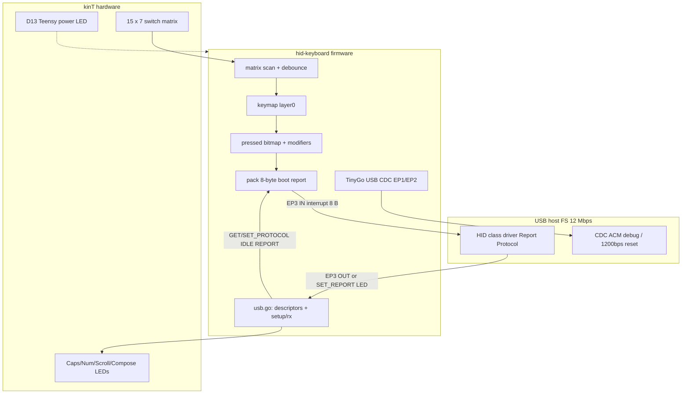
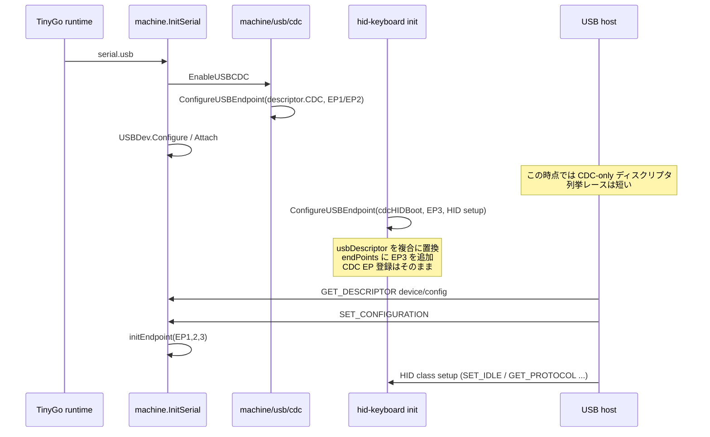
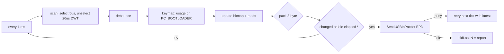

# kinT TinyGo HID キーボードファームウェア設計

| 項目 | 内容 |
| --- | --- |
| 文書タイトル | kinT + Teensy 4.1 TinyGo HID キーボード（Goal 1） |
| 著者 | TBD |
| 日付 | 2026-09-20 |
| ステータス | Draft |
| 対象ディレクトリ | `hid-keyboard/` |
| 対象ハードウェア | [kinT (kint41)](https://github.com/kinx-project/kint) = Kinesis Advantage コントローラ置換 + Teensy 4.1 (MIMXRT1062) |

本設計の実装スコープは **Goal 1: USB Full Speed + HID Report Protocol** である。USB セットアップは Goal 2（HID Boot Protocol / `SET_PROTOCOL` / `GET_PROTOCOL`）を後から足しても組み直さない形にする。USB High Speed は TinyGo `machine/usb` の 64 バイトエンドポイント前提に阻まれるため、本リポジトリの将来課題（Goal 3）とし、Goal 1 では扱わない。

---

## Overview

現行の `hid-keyboard/main.go` は、15×7 マトリクスを走査し、いずれかのキーが押されたら TinyGo 標準の `machine/usb/hid/keyboard.Port()` で `"tinygo"` をタイプする検証スタブである。製品ファームウェアではない。`keyboard.Port()` は `init()` で `descriptor.CDCHID`（キーボード + マウス + Consumer、Report ID 付き、Interface Subclass 0）を登録し、クラスリクエストは `SET_IDLE` しか扱わない。Goal 2 で必須の `SET_PROTOCOL` / `GET_PROTOCOL` を後付けできない。

本設計では `keyboard.Port()` を使わない。`github.com/sago35/tinygo-keyboard` の `via.go` と同じく、`machine.ConfigureUSBEndpoint` でディスクリプタとエンドポイント／セットアップハンドラを自前登録する。HID インタフェースは **Boot Interface Subclass + Keyboard Protocol** を Goal 1 の時点で宣言し、入力レポートは **Report ID なしの 8 バイト boot-compatible 形式** に固定する。Goal 1 では常に Report Protocol（リセット直後の HID 仕様デフォルト）として 8 バイトを送り、`SET_PROTOCOL` は値を保持して ACK するだけにする。これで Goal 2 は「プロトコル値に応じた振る舞いの検証と、必要なら NKRO 分岐」に閉じる。

キーマップは QMK `keyboards/kinesis/kint41` のマトリクス座標と default QWERTY を正とする。スキャン極性は本リポジトリで実機確認済みの「行をドライブ、列を読む」を採用する。CDC は TinyGo Teensy 4.1 のデフォルトシリアルとして残し、デバッグ印刷と `tinygo flash` の 1200 bps リセットを維持する。

---

## Background & Motivation

### 現状

| パス | 役割 | 問題 |
| --- | --- | --- |
| `hid-keyboard/main.go` | TinyGo USB HID のスモークテスト | `keyboard.Port()` 依存。キーマップなし。押下で `"tinygo"` を送るだけ |
| `tinygo-keyboard/` | `sago35/tinygo-keyboard` + Vial + JP 寄りのレイアウト | 製品アーキテクチャではない。内部で結局 `k.Port()` を使う。Vial 用に EP6/EP7 を足す |
| `usb-midi/main.go` | 同じマトリクスで MIDI ノート | HID とは無関係。ピン配置の参照には使える |
| QMK `kinesis/kint41` | 現行の実用ファーム | 参照実装。USB HS・NKRO・QMK キーコード。TinyGo にはそのまま持ち込めない |

本リポジトリ README は TinyGo を PR [#5704](https://github.com/tinygo-org/tinygo/pull/5704)（flash）でビルドする。#5704 は #5691 にブロックされ、USB コミットを含む。**ビルドは README どおり #5704 を checkout する**（これで USB デバイスも入る）。USB デバイス本体は PR [#5691](https://github.com/tinygo-org/tinygo/pull/5691)（sago35, `machine/mimxrt1062: add USB device (CDC) support for Teensy 4.x`）。Goal 1 のファームは `machine.Flash` を呼ばない。

### #5691 が決めるハードウェア制約

`machine_mimxrt1062_usb.go` より:

- USB1 デバイスコントローラを TinyGo `machine/usb` に接続している。
- DMA 用 dQH / dTD / EP バッファは DTCM ではなく **4 KiB 非キャッシュ OCRAM**（リンカの `_usb_dma_start`）。USB DMA は DTCM を触れない。
- `PORTSC1.PFSC` で **Full Speed (12 Mbps) に固定**。`machine/usb` が 64 バイト EP 前提のため。
- ハードウェア EP バッファも 64 バイト。`SendUSBInPacket` は 64 バイト超を拒否する。
- VID:PID デフォルト `16C0:0483`（`board_teensy41.go`）。シリアルはチップユニーク ID。
- `NumberOfUSBEndpoints = 8`。
- バスリセット時に IN 転送中だった EP は `usbTxCancelled` 経由で `initEndpoint` 時に TxHandler を呼ぶ。TxHandler を登録しない実装では単に再送をメインループに任せる。

### TinyGo 標準 HID キーボードが Goal 2 と衝突する理由

`src/machine/usb/descriptor/hid.go` の `descriptor.CDCHID`:

- Interface 2: Class HID, **Subclass 0, Protocol 0**（Boot 非対応）。
- Report descriptor がキーボード（Report ID 2）+ マウス（ID 1）+ Consumer（ID 3）の複合。
- キーボード入力は **9 バイト**（Report ID + 8 バイト）。Boot Protocol は Report ID を禁止し、固定 8 バイトを要求する。
- `src/machine/usb/hid/hid.go` の `setupHandler` は `SET_IDLE` のみ。`SET_PROTOCOL` / `GET_PROTOCOL` / `GET_REPORT` / `SET_REPORT` は未処理（未処理は EP0 stall）。
- `keyboard.Port()` はパッケージ `init()` で `hid.SetHandler` → 上記ディスクリプタを登録する。import した時点で USB 構成が奪われる。

したがって Goal 1 から **`machine/usb/hid/keyboard` も `machine/usb/hid` も import しない**。

### 痛み

- 検証スタブでは実キー入力ができない。
- `tinygo-keyboard` は動くが、Vial・6 レイヤ・`k.Port()` 前提で、Boot Protocol を足すと USB 層を作り直すことになる。
- QMK kint41 は HS + NKRO で、TinyGo FS 64 バイト EP とは前提が違う。マトリクスとキーマップだけ移植する。

---

## Goals & Non-Goals

### Goals（Goal 1）

1. kinT 実機で、QMK default 相当の **単層 QWERTY** が macOS / Linux の HID キーボードとして入力できる。
2. USB **Full Speed**、HID **Report Protocol**。入力レポートは 8 バイト boot-compatible（6KRO + modifier）。
3. USB 登録は `machine.ConfigureUSBEndpoint`。`keyboard.Port()` 禁止。
4. `SET_PROTOCOL` / `GET_PROTOCOL` / `SET_IDLE` / `GET_IDLE` / `SET_REPORT` / `GET_REPORT` の **フックが Goal 1 で存在する**。プロトコル切替のレポート分岐は Goal 2。ただし 8 バイト固定なので Goal 1 の送信経路は Goal 2 でもそのまま使える。
5. TinyGo デフォルトの **USB CDC を共存**させる（デバッグと 1200 bps リセット）。
6. Caps/Num/Scroll/Compose LED を `SET_REPORT` および Interrupt OUT で点灯できる。

### Non-Goals

| 項目 | 扱い |
| --- | --- |
| HID Boot Protocol の BIOS/UEFI 実地検証 | Goal 2 |
| NKRO / ビットマップレポート | Goal 2 以降。内部状態は全キー分持つが、送信は 6KRO |
| USB High Speed (480 Mbps) | Goal 3。TinyGo `machine/usb` 側の変更が必要 |
| Vial / VIA / QMK 互換動的キーマップ | 対象外。`tinygo-keyboard/` に残す |
| マウス・Consumer・MIDI・マクロ・コンボ・タップダンス | 対象外 |
| キーマップの Flash 保存 | 対象外（`machine.Flash` は呼ばない。ビルド自体は README の #5704 を使う） |
| 複数レイヤ / `MO()` / ホールド | Goal 1 は単層。配列サイズだけ 2 レイヤ分確保 |
| JIS 専用キー（無変換 0x8B 等）のキーキャップ完全再現 | ホスト側レイアウトに任せる。ファームは QMK US HID usage |
| `-serial uart` | 非対応。`serial.usb` が無いと `initUSB()` 自体が走らない |
| Windows ホスト | Goal 1 非目標。`16C0:0483` の CDC+HID 複合は Windows の `Usbccgp` / `hidclass` 選択を混乱させうる。macOS / Linux のみ |

---

## Key Decisions

1. **`keyboard.Port()` / `machine/usb/hid` を使わない。**  
   `init()` 副作用で `descriptor.CDCHID` が入り、Boot 非対応かつ `SET_PROTOCOL` が stall する。Goal 2 で USB を書き直すことになる。

2. **`machine.ConfigureUSBEndpoint` で CDC + HID Boot Keyboard 複合ディスクリプタを自前登録する。**  
   パターンは `tinygo-keyboard/via.go` と同じ。グローバル `descriptor.CDCHID` は破壊しない（Vial 実装は in-place で `Configuration[2..4]` / `HID[3]` を書いており、他パッケージと衝突する）。HID class descriptor の `wDescriptorLength` は `descriptor.ClassHIDType{data: ...}` では書けない（`data` が非公開）。`descriptor.Append` した conf に対して `FindClassHIDType` でパッチする。

3. **HID インタフェースは Goal 1 から Boot subclass=1, protocol=1 を名乗る。**  
   Goal 2 で subclass を変えると OS のデバイス認識が変わる。Report Protocol がデフォルト（HID 1.11 Appendix F）なので、Goal 1 の「Report Protocol のみ話す」と矛盾しない。

4. **入力レポートは Report ID なし 8 バイト（modifier, reserved, 6 keys）。**  
   Boot Protocol と同じレイアウト。Goal 1 も Goal 2 も同じパケットを送れる。NKRO は将来 Report Protocol 側にだけ足す。

5. **6KRO。内部状態は押下ビットマップ。**  
   pack は usage `0x04`–`0xDF` を昇順に最大 6 個入れる（`0xE0`–`0xE7` は modifier ビット。`0x00`–`0x03` はキーマップに置かない）。7 キー目以降は HID ErrorRollOver (`0x01`) を 6 スロット全てに入れる（HID spec Appendix C）。modifier は 6KRO に数えない。

6. **CDC を残す。VID:PID は Teensy デフォルト `16C0:0483` を維持。**  
   `targets/teensy41.json` の `serial-port: ["16c0:0483"]` と 1200 bps リセットが切れると、アプリから HalfKay に入れずボタン操作が必要になる。製品用 PID（QMK の `1209:345C` や Teensyduino keyboard `16C0:04D2`）は Goal 2 以降の選択肢。

7. **キーマップは QMK kint41 default（US HID usage）、単層。**  
   `tinygo-keyboard/main.go` の JP 定数の多くは同じ HID usage の別名（例: US `KeyEqual` 0x2E = JP `KeyHat` 0x2E）。文字の見え方はホスト OS のキーボードレイアウトで決まる。親指クラスタは QMK default を正とし、tinygo-keyboard 側の入れ替えは採用しない。

8. **マトリクスは QMK COL2ROW と同じ極性: 行ドライブ Low、列プルアップ、押下は列 Low。**  
   QMK `quantum/matrix.c` の `DIODE_DIRECTION == COL2ROW` は `select_row()`（行を出力 Low）→ 列ピンを読む。`keyboard.json` の `"diode_direction": "COL2ROW"` は現行 `hid-keyboard/main.go` / `usb-midi/main.go` と一致する。残差は unselect だけ: QMK 既定は行を Hi-Z+pull-up（`MATRIX_UNSELECT_DRIVE_HIGH` は kint41 では未定義）、スタブは非選択行を High のまま出力する。tinygo-keyboard の `InvertDiode(true)`（行 High / 列 pulldown）は使わない。  
   遅延は **unselect 後に DWT/CYCCNT busy-wait 20 µs**（`kint41.c` の `matrix_output_unselect_delay`。列が HIGH に戻るのを待つ）。select 後は短い settle（1–5 µs、同じく DWT）。スキャン内側で `time.Sleep` は使わない。

9. **デバウンスは 5 ms の per-key defer（連続一致）。スキャン周期 1 ms。**  
   QMK は `debounce: 50` + `sym_eager_pk` と非常に長い。Goal 1 は 5 ms を初期値にし、定数で変更可能にする。チャタリングが出たら上げる。

10. **USB クラスハンドラは Goal 1 で実装する（スタブではない ACK）。**  
    `SET_PROTOCOL` は値を保存して ZLP。送信フォーマットは 8 バイトのまま。`SET_REPORT` は LED に反映する（kinT にインジケータがあるため、Goal 1 でやる価値がある）。`GET_REPORT` は HID 必須リクエストなので last-sent 入力レポート／現在の LED を返す。

11. **`[13,5]` は `KC_BOOTLOADER = 0xF000` → `machine.EnterBootloader()`。**  
    QMK default の `QK_BOOT` 相当。`Keycode` は `uint16`。`0x0001`–`0x00E7` が HID usage、`0xF000` 以降がファームアクション。`packBoot` は `>= 0xE8` をレポートに入れない（modifier `0xE0`–`0xE7` 以外）。HID usage `0xFF` を番兵にしない。

12. **登録は `package main` の `init()`。`machine/usb/hid/keyboard` を import しない。**  
    TinyGo は `serial.usb` 時に `InitSerial` → `initUSB` → `EnableUSBCDC` → `USBDev.Configure`（Attach）を main より前に行う。ディスクリプタ置換が `main()` だと、ホストが CDC-only で列挙するレースがある。`init()` で `ConfigureUSBEndpoint` する（tinygo-keyboard `via.go` と同じ）。

---

## Proposed Design

### 全体像



### パッケージ / ファイル配置

実装ディレクトリは `hid-keyboard/`。`tinygo flash --target teensy41 ./hid-keyboard` がそのまま通るよう、**全て `package main`** に置く（TinyGo のファームウェアではサブパッケージの恩恵よりビルド単純さを取る）。

```
hid-keyboard/
  design.md      本設計
  main.go        init 配線、メインループ、デバッグ印刷
  usb.go         複合ディスクリプタ、ConfigureUSBEndpoint、setup/rx
  hid.go         protocol/idle 状態、8 バイト pack、送信、GET_REPORT 用キャッシュ（`runtime/interrupt`）
  matrix.go      ピン、走査、デバウンス
  keycode.go     HID usage 定数と KC_BOOTLOADER
  keymap.go      QMK default 相当の layer0
  led.go         インジケータ GPIO（active low）と power LED
```

`go.mod` の `github.com/sago35/tinygo-keyboard` は `tinygo-keyboard/` 用であり、`hid-keyboard/` は依存しない。

現行 `hid-keyboard/main.go` の `keyboard.Port()` スタブは Goal 1 実装で **置き換えて削除する**（`hid-keyboard/smoke/` には残さない）。デフォルトビルド対象は本設計の `hid-keyboard/` のみ。`tinygo-keyboard/` と `usb-midi/` は別 main として残す。

### USB スタック配線（`keyboard.Port()` なし）

#### 初期化順



`ConfigureUSBEndpoint`（`src/machine/usb.go`）は:

- `usbDescriptor = desc` で **置換**
- `endPoints` / handler 配列へ **追記**（CDC 分は消えない）
- `usbSetupHandler[Index]` は上書き

そのため HID 側は **EP3 だけ** 登録する。CDC の EP1/EP2 と `CDC_ACM_INTERFACE` ハンドラは `EnableUSBCDC` のものを使う。複合ディスクリプタの CDC 部分は、既に登録済みの EP 番号・インタフェース番号と一致させる。

#### インタフェース / エンドポイント割り当て

TinyGo 定数（`src/machine/usb/usb.go`）に合わせる。

| 番号 | 用途 | クラス | 備考 |
| --- | --- | --- | --- |
| IF 0 | CDC ACM | 0x02/0x02/0x01 | 既存 |
| IF 1 | CDC Data | 0x0A | 既存 |
| IF 2 | HID Keyboard | 0x03 / **0x01 Boot** / **0x01 Keyboard** | 本設計。標準 `InterfaceHID` は 0x00/0x00 なので **コピーして書き換える** |

| EP | 方向 | 転送 | wMaxPacket | bInterval | 用途 |
| --- | --- | --- | --- | --- | --- |
| 0 | IN/OUT | Control | 64 | — | 標準 + クラス setup |
| 1 | IN | Interrupt | 16 | 16 | CDC ACM 通知（既存） |
| 2 | OUT | Bulk | 64 | 0 | CDC OUT（既存） |
| 2 | IN | Bulk | 64 | 0 | CDC IN（既存） |
| 3 | IN | Interrupt | **8** | **1** | HID 入力レポート |
| 3 | OUT | Interrupt | **8** | **1** | HID LED 出力レポート |

Boot Keyboard の Interrupt IN は HID 1.11 Appendix B で **wMaxPacketSize = 8**。Goal 2 の BIOS がここを見る。ハードウェア dQH は `initEndpoint` が常に 64 バイトで切るが、送るのは 8 バイトだけなのでディスクリプタ上は 8 でよい。`bInterval = 1` は FS で 1 ms。QMK kint41 の `USB_POLLING_INTERVAL_MS 1` に合わせる（あちらは HS マイクロフレームの話なので、FS では 1 ms が最短）。

#### ディスクリプタ組み立て

`descriptor.CDCHID` を mutate しない。CDC 部分は TinyGo の部品を `descriptor.Append` でつなぎ、HID だけ差し替える。

`ClassHIDType.data` は非公開なので `descriptor.ClassHIDType{data: class}` はコンパイルできない。`ClassLength` は組み立て後の conf を `FindClassHIDType` で探す。グローバル `classHID` の既定 `wDescriptorLength` は `0x91`（マウス+キーボード+Consumer）であり、本 Boot レポートの長さではない。

`InterfaceHID.Bytes()` はプロセスグローバル配列への alias なので、subclass/protocol を書く前にコピーする。`Append` はコピーを返す。`EndpointIN`/`OUT` は EP 番号ごとのグローバルを書くが、本ディスクリプタは EP1 IN / EP2 IN / EP2 OUT / EP3 IN / EP3 OUT の 5 スロットで重複しない。同じ EP を 1 つの `[][]byte` リテラルで二度 `EndpointIN` すると alias するので、そうしない。

```go
// usb.go
func buildDescriptor() descriptor.Descriptor {
    iface := append([]byte(nil), descriptor.InterfaceHID.Bytes()...)
    iface[6] = 0x01 // bInterfaceSubClass: Boot
    iface[7] = 0x01 // bInterfaceProtocol: Keyboard

    report := bootKeyboardReportDescriptor() // Report ID なし

    conf := descriptor.Append([][]byte{
        descriptor.ConfigurationCDCHID.Bytes(), // bNumInterfaces=3 済み
        descriptor.InterfaceAssociationCDC.Bytes(),
        descriptor.InterfaceCDCControl.Bytes(),
        descriptor.ClassSpecificCDCHeader.Bytes(),
        descriptor.ClassSpecificCDCACM.Bytes(),
        descriptor.ClassSpecificCDCUnion.Bytes(),
        descriptor.ClassSpecificCDCCallManagement.Bytes(),
        descriptor.EndpointIN(descriptor.EndpointEP1, descriptor.TransferTypeInterrupt, 0x10, 0x10).Bytes(),
        descriptor.InterfaceCDCData.Bytes(),
        descriptor.EndpointOUT(descriptor.EndpointEP2, descriptor.TransferTypeBulk, 0x40, 0x00).Bytes(),
        descriptor.EndpointIN(descriptor.EndpointEP2, descriptor.TransferTypeBulk, 0x40, 0x00).Bytes(),
        iface,
        descriptor.ClassHID.Bytes(), // 長さは次の FindClassHIDType で上書き
        descriptor.EndpointIN(descriptor.EndpointEP3, descriptor.TransferTypeInterrupt, 8, 1).Bytes(),
        descriptor.EndpointOUT(descriptor.EndpointEP3, descriptor.TransferTypeInterrupt, 8, 1).Bytes(),
    })
    h, err := descriptor.FindClassHIDType(conf, descriptor.ClassHID.Bytes())
    if err != nil {
        // init 時点。ディスクリプタ組み立て失敗は起動不能
        panic(err)
    }
    h.ClassLength(uint16(len(report)))

    return descriptor.Descriptor{
        Device:        descriptor.DeviceCDC.Bytes(), // 0xEF/0x02/0x01 IAD。Configure() がこのグローバルを mutate する（TinyGo 既存動作）
        Configuration: conf,
        HID:           map[uint16][]byte{usb.HID_INTERFACE: report},
    }
}
```

`GET_DESCRIPTOR` Device 時に TinyGo が `usbDescriptor.Configure(vid, pid)` を呼び、VID/PID と `wTotalLength` を書き込む。`FindClassHIDType` は ClassHID の末尾 2 バイト（ClassLength）を除いて検索するので、パッチ後も再検索できる。

HID report descriptor のキー（`usbDescriptor.HID[wIndex]`）は **インタフェース番号 2**。`sendDescriptor` の `TypeHIDReport` 分岐が `setup.WIndex` で引く。

文字列:

```go
usb.Manufacturer = "kinT"
usb.Product      = "kinT TinyGo"
// Serial は空のまま → mimxrtSerialNumber()（チップ ID）
// VendorID / ProductID は 0 のまま → board_teensy41.go の 16C0:0483
```

#### HID レポートディスクリプタ（Boot Keyboard、Report ID なし）

HID 1.11 Appendix B.1 に沿う。LED は 5 ビット（Num/Caps/Scroll/Compose/Kana）。kinT の 4 LED + 未使用 Kana に一致する。TinyGo 標準の「LED 3 ビット + Report ID 2」は使わない。

```go
func bootKeyboardReportDescriptor() []byte {
    return descriptor.Append([][]byte{
        descriptor.HIDUsagePageGenericDesktop,
        descriptor.HIDUsageDesktopKeyboard,
        descriptor.HIDCollectionApplication,

        // Input: modifier 8 bits
        descriptor.HIDUsagePageKeyboard,
        descriptor.HIDUsageMinimum(224),
        descriptor.HIDUsageMaximum(231),
        descriptor.HIDLogicalMinimum(0),
        descriptor.HIDLogicalMaximum(1),
        descriptor.HIDReportSize(1),
        descriptor.HIDReportCount(8),
        descriptor.HIDInputDataVarAbs,

        // Input: reserved 8 bits
        descriptor.HIDReportCount(1),
        descriptor.HIDReportSize(8),
        descriptor.HIDInputConstVarAbs,

        // Output: 5 LED bits + 3 padding
        descriptor.HIDUsagePageLED,
        descriptor.HIDUsageMinimum(1),
        descriptor.HIDUsageMaximum(5),
        descriptor.HIDReportCount(5),
        descriptor.HIDReportSize(1),
        descriptor.HIDOutputDataVarAbs,
        descriptor.HIDReportCount(1),
        descriptor.HIDReportSize(3),
        descriptor.HIDOutputConstVarAbs,

        // Input: 6-key array
        descriptor.HIDUsagePageKeyboard,
        descriptor.HIDUsageMinimum(0),
        descriptor.HIDUsageMaximum(255),
        descriptor.HIDLogicalMinimum(0),
        descriptor.HIDLogicalMaximum(255),
        descriptor.HIDReportSize(8),
        descriptor.HIDReportCount(6),
        descriptor.HIDInputDataAryAbs,

        descriptor.HIDCollectionEnd,
    })
}
```

`FindClassHIDType` で書いた `ClassLength` は `len(report)` と一致していなければならない。PR1 レビューで `len(report)` と conf 内 HID descriptor の `wDescriptorLength` を突き合わせる。

#### `ConfigureUSBEndpoint` 呼び出し

```go
func init() {
    usb.Manufacturer = "kinT"
    usb.Product = "kinT TinyGo"

    machine.ConfigureUSBEndpoint(buildDescriptor(),
        []usb.EndpointConfig{
            {
                Index:     usb.HID_ENDPOINT_OUT, // 3
                IsIn:      false,
                Type:      usb.ENDPOINT_TYPE_INTERRUPT,
                RxHandler: hidRxLEDs,
            },
            {
                Index: usb.HID_ENDPOINT_IN, // 3
                IsIn:  true,
                Type:  usb.ENDPOINT_TYPE_INTERRUPT,
                // TxHandler は置かない。メインループが最新スナップショットを送る
            },
        },
        []usb.SetupConfig{
            {Index: usb.HID_INTERFACE, Handler: hidSetup},
        },
    )
}
```

`main()` で `machine.USBDev.Configure` を再度呼ぶ必要はない（`initcomplete` なら no-op）。現行スタブの `Configure` 呼び出しは削除する。

### HID レポート形式

```
byte 0  modifier  bit0 LCtrl, 1 LShift, 2 LAlt, 3 LGUI,
                  bit4 RCtrl, 5 RShift, 6 RAlt, 7 RGUI
byte 1  reserved  0x00
byte 2..7  HID usage page 7 keycodes, 0x00 = empty
```

Goal 2 の Boot Protocol もこの 8 バイトである。Goal 1 の Report Protocol も同じディスクリプタなので同じ 8 バイトを送る。

将来 NKRO を足すとき:

- Boot (`protocol == 0`): 今の 8 バイトのまま
- Report (`protocol == 1`): Report ID 付きビットマップ等に変更 → **ディスクリプタ追加が必要**
- そのため `packReport` は `protocol` を見て分岐できるシグネチャにする。Goal 1 は常に 8 バイトの静的配列を返す（ヒープ `[]byte` を毎スキャン確保しない）。

```go
func packReport(pressed *[32]byte, mods uint8, protocol uint8) (out [8]byte) {
    // Goal 1: protocol を無視して boot 8 バイト
    return packBoot(pressed, mods)
}

func packBoot(pressed *[32]byte, mods uint8) (out [8]byte) {
    out[0] = mods
    n := 0
    // usage 0x04–0xDF を昇順。0xE0–0xE7 は mods 側。0x00–0x03 はキーマップに置かない。
    for usage := uint8(0x04); usage <= 0xDF; usage++ {
        if pressed[usage/8]&(1<<(usage%8)) == 0 {
            continue
        }
        n++
        if n > 6 {
            for i := 2; i < 8; i++ {
                out[i] = 0x01 // ErrorRollOver
            }
            return out
        }
        out[1+n] = usage // slots out[2]..out[7]
    }
    return out
}
```

6KRO 超過時は 6 スロットを全て `0x01` にする。部分的に 6 キーだけ送ると、ホストが「7 キー目が離された」と誤解する。

### コントロール転送（Goal 1 で配線、Goal 2 で意味が増える）

クラスリクエストは IF 2 宛。`handleEP0Setup` は standard 以外を `usbSetupHandler[WIndex]` に渡す。`BmRequestType` は TinyGo 定数で:

- Host→Device class interface = `0x21`（`usb.SET_REPORT_TYPE` / `REQUEST_HOSTTODEVICE_CLASS_INTERFACE`）
- Device→Host class interface = `0xA1`（`REQUEST_DEVICETOHOST_CLASS_INTERFACE`）

`bRequest`（`src/machine/usb/usb.go`）と `wValue` / `wLength`:

| bRequest | 値 | wValueH | wValueL | wLength | Goal 1 |
| --- | --- | --- | --- | --- | --- |
| GET_REPORT | 1 | 1 Input / 2 Output / 3 Feature | Report ID（Boot は 0） | ホスト要求長 | Input: `hidLastIN` の先頭 `min(8, WLength)` バイト。Output: LED 1 バイト。Feature または未知 type / 非 0 の Report ID は `false`（EP0 stall）。 |
| GET_IDLE | 2 | — | Report ID（無視して 1 つの idle） | 1 | `hidIdle` 1 バイト |
| GET_PROTOCOL | 3 | 0 | 0 | 1 | `hidProtocol`（0 boot / 1 report） |
| SET_REPORT | 9 | 2 Output（Feature は未使用） | Report ID 0 | 0 または 1+ | `WLength == 0`: ZLP して true（`ReceiveUSBControlPacket` は呼ばない。IRQ 内で `usbSpinLimit` スピンして stall する）。Output: データステージ先頭バイトを `applyLEDs`。それ以外の type は stall。 |
| SET_IDLE | 10 | duration（4 ms 単位） | Report ID | 0 | `hidIdle = WValueH`。0 = 変化時のみ。ZLP |
| SET_PROTOCOL | 11 | 0 | 0 boot / 1 report | 0 | `hidProtocol = WValueL`。ZLP。**Goal 1 は送信フォーマットを変えない** |

```go
const (
    protocolBoot   = 0
    protocolReport = 1
)

var (
    hidProtocol uint8 = protocolReport // 電源投入後は Report（HID Appendix F）
    hidIdle     uint8 = 0              // 変化時のみ。Goal 2 で Boot 時 default 125 を検討
    hidLEDs     uint8
    hidLastIN   [8]byte // GET_REPORT / 変化検出用。IRQ と main で共有
)

func hidSetup(setup usb.Setup) bool {
    switch setup.BmRequestType {
    case usb.REQUEST_HOSTTODEVICE_CLASS_INTERFACE:
        switch setup.BRequest {
        case usb.SET_IDLE:
            hidIdle = setup.WValueH
            machine.SendZlp()
            return true
        case usb.SET_PROTOCOL:
            hidProtocol = setup.WValueL
            machine.SendZlp()
            return true
        case usb.SET_REPORT:
            if setup.WLength == 0 {
                machine.SendZlp()
                return true
            }
            if setup.WValueH != 2 { // Output
                return false
            }
            b, err := machine.ReceiveUSBControlPacket()
            if err != nil {
                return false
            }
            applyLEDs(b[0])
            machine.SendZlp()
            return true
        }
    case usb.REQUEST_DEVICETOHOST_CLASS_INTERFACE:
        switch setup.BRequest {
        case usb.GET_IDLE:
            return machine.SendUSBInPacket(0, []byte{hidIdle})
        case usb.GET_PROTOCOL:
            return machine.SendUSBInPacket(0, []byte{hidProtocol})
        case usb.GET_REPORT:
            if setup.WValueL != 0 { // boot は report ID 0
                return false
            }
            switch setup.WValueH {
            case 1: // Input
                var local [8]byte
                state := interrupt.Disable()
                local = hidLastIN
                interrupt.Restore(state)
                n := int(setup.WLength)
                if n > 8 {
                    n = 8
                }
                return machine.SendUSBInPacket(0, local[:n])
            case 2: // Output
                return machine.SendUSBInPacket(0, []byte{hidLEDs})
            default:
                return false // Feature 等は stall
            }
        }
    }
    return false
}

// Interrupt OUT。mimxrt は dQH を 64 バイトで prime する。descriptor の wMaxPacket=8 でも
// ハンドラは 1..64 を許容する。len==0 は無視。アロケーション禁止。
func hidRxLEDs(b []byte) {
    if len(b) == 0 {
        return
    }
    applyLEDs(b[0])
}
```

注意:

- `ReceiveUSBControlPacket` の戻りは `[cdcLineInfoSize]byte`（**7 バイト**）。LED 1 バイトには足りる。`WLength == 0` で呼んではいけない（USB IRQ 内で最大 5e6 スピン → stall）。
- TinyGo `sendDescriptor` は HID **class** descriptor（type `0x21`）の単独 GET_DESCRIPTOR を扱わず ZLP を返す。通常ホストは configuration 内の HID descriptor を使う。BIOS が type 0x21 を要求したら Goal 2 で TinyGo 側修正が必要（本ファームの class setupHandler には standard GET_DESCRIPTOR は来ない）。
- Interrupt OUT と SET_REPORT は同じ `applyLEDs` に集約する。
- **USB リセット後の protocol/idle:** HID 7.2.6 はリセット後 Report Protocol を要求する。TinyGo `handleUSBBusReset` はアドレスと `usbConfiguration`（非公開）だけを 0 にし、アプリ状態は残る。`InitEndpointComplete` もリセットで false に戻らない。アプリから `usbConfiguration` は読めない。Goal 1 はこれを **既知の TinyGo ギャップ** とし、protocol/idle をバスリセットで戻さない。Goal 2 の BIOS が SET_PROTOCOL(0) のあとリセットして GET_PROTOCOL が Boot のままなら、TinyGo にリセットフックを足す。

### マトリクススキャン

#### ピン（QMK `kint41/keyboard.json` = 現行 TinyGo コード）

```go
var rows = []machine.Pin{ // 15
    machine.D8, machine.D9, machine.D10, machine.D11, machine.D7,
    machine.D16, machine.D5, machine.D3, machine.D4, machine.D1,
    machine.D0, machine.D2, machine.D17, machine.D23, machine.D21,
}
var cols = []machine.Pin{ // 7
    machine.D18, machine.D14, machine.D15,
    machine.D20, machine.D22, machine.D19, machine.D6,
}
```

QMK の `LINE_PINx` は Teensy デジタルピン番号 `Dx` に一致する。

#### ダイオードとドライブ方向

QMK JSON は `"diode_direction": "COL2ROW"`。QMK `quantum/matrix.c` でこれは **行を出力 Low（`select_row`）、列を入力プルアップで読む**。`ROW2COL` が列ドライブである。現行スタブと同じ極性。

| 実装 | 選択 | 非選択 | 入力 | 押下 |
| --- | --- | --- | --- | --- |
| QMK COL2ROW（`matrix.c`） | 行 Low | 行 Hi-Z+pull-up（kint41 は `MATRIX_UNSELECT_DRIVE_HIGH` 未定義） | 列 Pullup | 列 Low |
| `hid-keyboard/main.go`, `usb-midi/main.go` | 行 Low | 行 High（出力のまま） | 列 Pullup | `!col.Get()` |
| `tinygo-keyboard` + `InvertDiode(true)` | 行 High | 行を pulldown 入力に戻す | 列 Pulldown | `col.Get()` |

Goal 1 は **hid-keyboard スタブと同じ**（行 Low 選択、非選択行は High 出力、列 Pullup、押下は Low）。QMK との差は unselect が Hi-Z ではなく drive-High なことだけ。drive-High の方が列の立ち上がりは速いが、kint41 が測った 20 µs は Hi-Z 復帰向けなので、同じ 20 µs を unselect 後に置く（過剰でも害は少ない）。tinygo-keyboard の反転スキームは使わない。

ダイオードはスイッチと直列なので、同時押しでもゴーストはハードウェアが防ぐ。ソフトウェア側のアンチゴーストは実装しない。未実装交差点は常にオープン。キーマップは `KC_NO`。

#### セトル / unselect 遅延（DWT busy-wait。`time.Sleep` 禁止）

`kint41.c` がオーバーライドしているのは **`matrix_output_unselect_delay`**（行を離したあと「wait for all Col signals to go HIGH」）である。QMK COL2ROW の順は:

1. `select_row`（行 Low）
2. `matrix_output_select_delay()` — kint41 は `GPIO_INPUT_PIN_DELAY 0` なのでほぼ 0
3. 列を読む
4. `unselect_row`
5. **`matrix_output_unselect_delay` = 20 µs**（5 µs では不足、一部 KB600LF+stapelberg+teensy41 は 20 µs）

20 µs を `row.Low()` の直後に置くのは kint41 の計測対象ではない。Goal 1 は **unselect（`row.High()`）のあとに 20 µs**、select 後に短い settle（**5 µs**。高速 GPIO なら 1 µs でも足りうるが定数は 5）。

`time.Sleep(20 * time.Microsecond)` は使わない。TinyGo `time.Sleep` は協調スケジューラ（`addSleepTask` + `task.Pause`）。mimxrt の `sleepTicks` は PIT 24 MHz で `(last-curr)/pitCyclesPerMicro` するため、サブ〜24 µs は 0 カウントになり、`hasScheduler` なら `timerSleep` がすぐ戻る。QMK が DWT `CYCCNT` を使った理由と同じ。TinyGo は `initSysTick` で DWT を既に有効化している（`runtime_mimxrt1062_time.go`）。

TinyGo `Pin.Get` は GPIO6–9（AHB、`getGPIO()` + `initPins` GPR26–29）を使う。遅延の理由はレジスタ速度ではなくマトリクスのアナログ RC である。

```go
// matrix.go。Teensy 4.1 TinyGo CORE_FREQ = 600 MHz。
const cyclesPerUs = 600

var dwtCYCCNT = (*volatile.Register32)(unsafe.Pointer(uintptr(0xe0001004)))

func delayUs(us uint32) {
    start := dwtCYCCNT.Get()
    cycles := us * cyclesPerUs
    for dwtCYCCNT.Get()-start < cycles { // uint32 ラップ回り込み
    }
}
```

スキャン内側でスケジューラに yield しない。1 ms 周期の残り待ちだけ `time.Sleep` してよい。15 行 × (5+20) µs = 375 µs で 1 ms 周期に収まる。

#### デバウンス

```
scan interval     = 1 ms
debounce ticks    = 5     // 5 ms
algorithm         = per-key defer
```

各交差点にカウンタを持つ。生値が `debounced` と違う間だけカウントし、5 連続で一致したら遷移。QMK の eager（押下即登録、その後 50 ms 無視）より遅延は増えるが誤入力は減る。定数 `debounceTicks` で変更する。

ゴースト: ダイオード付きなので「3 点で 4 点目が立つ」現象は起きない。空セルを読んでもプルアップのまま。

#### スキャン疑似コード

```go
func (m *Matrix) scanOnce() {
    for r, row := range rows {
        row.Low()
        delayUs(5) // select settle
        for c, col := range cols {
            raw := !col.Get()
            m.debounce(r, c, raw)
        }
        row.High() // unselect: drive High（QMK 既定の Hi-Z ではない）
        delayUs(20) // unselect delay: 列が HIGH に戻るのを待つ
    }
}
```

起動時: 行は Output + High、列は InputPullup。`kint41.c` に倣い power LED `D13` を Output High。

### キーマップ

#### 表現

```go
type Keycode uint16 // 0x00=なし, 0x01–0xE7=HID usage page 7, 0xF000+=ファームアクション

const (
    NumRows   = 15
    NumCols   = 7
    NumLayers = 2
    KC_NO         Keycode = 0x0000
    KC_BOOTLOADER Keycode = 0xF000 // [13,5] QK_BOOT。EnterBootloader()
)

var layers [NumLayers][NumRows * NumCols]Keycode

func idx(row, col int) int { return row*NumCols + col }
```

`machine/usb/hid/keyboard` は import しない（`init()` が USB を奪う）。modifier は usage `0xE0–0xE7` をキーマップに置き、pack 時にビットへ折り畳む。`packBoot` は `kc >= 0xE8` をレポートに出さない。HID usage `0xFF`（予約）を番兵にしない。LANG2/Hanja は `0x91` であり `0xFF` ではないが、page 7 とファームアクションを混ぜない。

Goal 1 は layer 0 のみ読む。layer 1 は全 `KC_NO`。将来 `MO(1)` を足しても配列を広げなくてよい。

#### QMK LAYOUT → (row, col)

レシピ（PR3 の正）:

1. `keyboards/kinesis/kint41/keyboard.json` の `layouts.LAYOUT.layout` を **配列順** に辿る。各要素の `matrix: [row, col]` がセル。
2. 同じ順で `keyboards/kinesis/keymaps/default/keymap.c` の `LAYOUT(...)` 引数を割り当てる。kint41 配下に `keymaps/` は無い。
3. そのファイル先頭の ASCII アートは **使わない**（F7/F11 が欠け、FN0 と書いてあるが `LAYOUT()` は `KC_NO, QK_BOOT`）。

インデックスは `row*7+col`。layer0 の 105 セル（空きは `KC_NO`）。`RGUI` は HID `0xE7`（Right GUI）。`KC_BOOTLOADER = 0xF000`。

```go
// keymap.go layer0[row*7+col]。HID usage。0xF000 = bootloader。
var layer0 = [NumRows * NumCols]Keycode{
    // row 0
    0x2E, 0x2B, 0x39, 0xE1, 0x00, 0x00, 0x00, // = Tab Caps LSft
    // row 1
    0x1E, 0x14, 0x04, 0x1D, 0x35, 0x00, 0x00, // 1 Q A Z `
    // row 2
    0x1F, 0x1A, 0x16, 0x1B, 0x49, 0x4D, 0x00, // 2 W S X Ins End
    // row 3
    0x20, 0x08, 0x07, 0x06, 0x50, 0x4A, 0x2A, // 3 E D C Left Home Bspc
    // row 4
    0x21, 0x15, 0x09, 0x19, 0x00, 0x00, 0x4C, // 4 R F V           Del
    // row 5
    0x22, 0x17, 0x0A, 0x05, 0x4F, 0xE2, 0xE0, // 5 T G B Right LAlt LCtl
    // row 6
    0x23, 0x1C, 0x0B, 0x11, 0x52, 0x2C, 0x4E, // 6 Y H N Up Spc PgDn
    // row 7
    0x24, 0x18, 0x0D, 0x10, 0x00, 0x28, 0x00, // 7 U J M     Ent
    // row 8
    0x25, 0x0C, 0x0E, 0x36, 0x51, 0xE4, 0x4B, // 8 I K , Down RCtl PgUp
    // row 9
    0x26, 0x12, 0x0F, 0x37, 0x2F, 0x00, 0xE7, // 9 O L . [     RGUI
    // row 10
    0x27, 0x13, 0x33, 0x38, 0x30, 0x00, 0x00, // 0 P ; / ]
    // row 11
    0x2D, 0x31, 0x34, 0xE5, 0x00, 0x00, 0x00, // - \ ' RSft
    // row 12
    0x29, 0x3C, 0x3F, 0x42, 0x45, 0x48, 0x00, // Esc F3 F6 F9 F12 Pause
    // row 13
    0x3A, 0x3D, 0x40, 0x43, 0x46, 0xF000, 0x00, // F1 F4 F7 F10 PSCR BOOT
    // row 14
    0x3B, 0x3E, 0x41, 0x44, 0x47, 0x00, 0x00, // F2 F5 F8 F11 ScrLk (KC_NO)
}
```

物理キー 86。`(14,5)` は物理キーがあるが QMK default は `KC_NO`。

**親指クラスタ（QMK default。tinygo-keyboard とは入れ替えあり。こちらを採用）**

| (r,c) | QMK default | tinygo-keyboard（採用しない） |
| --- | --- | --- |
| 5,6 | LCtrl | LAlt |
| 5,5 | LAlt | LCtrl |
| 9,6 | RGUI | RCtrl |
| 8,5 | RCtrl | RAlt |
| 3,5 | Home | Home |
| 8,6 | PgUp | PgUp |
| 3,6 | Backspace | Delete |
| 4,6 | Delete | Backspace |
| 2,5 | End | End |
| 6,6 | PgDn | PgDn |
| 7,5 | Enter | Enter |
| 6,5 | Space | Space |

物理キー数は LAYOUT 配列どおり **86**。15×7=105 セルのうち残りはスイッチ無し。

#### US vs JP

ファームウェアが送るのは HID usage であり、ASCII ではない。QMK default の `KC_EQL` / `KC_QUOT` / `KC_GRV` は usage `0x2E` / `0x34` / `0x35` で、`tinygo-keyboard` の `KeyHat` / `KeyColon` / `KeyHankaku` と同じ値である。ホストを JIS 配列にすれば同じ物理キーが `^` / `:` / 半角になる。Goal 1 は QMK テーブルをそのまま送り、JIS 専用 usage（`0x87`–`0x8B` 等）は置かない。

### LED

QMK `indicators`（`on_state: 0` = active low）:

| 機能 | ピン | HID LED bit |
| --- | --- | --- |
| Caps Lock | D12 | bit 1 |
| Num Lock | D26 | bit 0 |
| Scroll Lock | D25 | bit 2 |
| Compose | D24 | bit 3 |
| Kana | （無し） | bit 4 は無視 |
| Power | D13 | USB とは無関係。起動時 High |

`applyLEDs(v uint8)` がビットをピンに書く。USB IRQ から呼ばれるので GPIO 書き込みだけ（`Pin.Set` は mimxrt で `DR_SET`/`DR_CLEAR`）。アロケーション禁止。`hidLEDs = v` を保持して GET_REPORT Output に使う。

### メインループ



送信方針:

- **変化時に送る**（Goal 1 の電源投入 default は `hidIdle == 0`）。HID 7.2.4 はキーボードに 500 ms（duration 125）を推奨するが、macOS/Linux のキーリピートは OS 側なので 0 が正しい。Goal 2 の BIOS は idle 再送に頼ることがある。SET_IDLE は実装するので BIOS が設定すれば効く。Goal 2 で Boot 時 default を 125 に変えてよい（送信経路はそのまま）。
- `hidIdle > 0` なら最後の成功送信から `hidIdle * 4 ms` 経過で再送。
- `SendUSBInPacket` が false なら次の 1 ms で **最新** スナップショットを再試行。キューしない。
- 全キー離したときは 8 ゼロを必ず 1 回送る。
- pack 結果は静的 `[8]byte`（`hidCurrent`）。成功送信後、`interrupt.Disable` 下で `hidLastIN = hidCurrent`。GET_REPORT は同様にローカル `[8]byte` へコピーしてから EP0 送信。スキャン／送信パスで `make` / ヒープ `[]byte` を出さない。

`KC_BOOTLOADER` はエッジ（押した瞬間）で `machine.EnterBootloader()`（HalfKay、`bkpt #251`）。その前に空レポートを送れると望ましいが、ブートローダ突入後は USB が切れる。

デバッグ:

```go
const debug = true // Goal 1 の PR2–PR4。PR5 で Goal 1 完了にする直前に false
```

- `debug == true` のとき押下/離鍵で CDC に `r,c idx usage` を `println`。86 キーの `(r,c)` を `keyboard.json` の `layout` 順と照合する。
- PR5 チェックリストで `false` にしてから Goal 1 完了とする。キーログをシリアルに残さない。

周期: スキャン ~0.4 ms + 処理。1 ms 周期の残りだけ `time.Sleep`。スキャン内側では DWT。USB bInterval=1 ms に対し 1–2 ms に 1 レポートなら十分。

期待負荷: キー入力バーストでも EP3 は 8 バイト / 1 ms = 8 KB/s。FS 12 Mbps に対して無視できる。CPU は 600 MHz 相当の Cortex-M7 でマトリクス走査は問題にならない。

### Goal 2 / Goal 3 で変わるもの（Goal 1 が角を折れないように）

**Goal 2 — HID Boot Protocol**

既に Goal 1 で用意するもの:

- Boot subclass/protocol ビット
- 8 バイト Report ID なし
- `SET_PROTOCOL` / `GET_PROTOCOL` の保存と ACK
- `SET_IDLE` / `GET_IDLE` / `GET_REPORT` / `SET_REPORT`

Goal 2 の作業:

- BIOS/UEFI / macOS 起動画面での入力確認。
- ホストが `SET_PROTOCOL(0)` した後も 8 バイトを送れていることのパケット確認。
- Boot モードの電源投入 default として `hidIdle = 125`（500 ms）を検討する。Report モードは 0 のままでよい。送信経路は変えない。
- バスリセット後に `hidProtocol` が Boot のまま残る TinyGo ギャップが出たら、リセットフックを TinyGo に足す。
- （任意）Report Protocol だけ NKRO に分岐。そのときは report descriptor に Report ID 付きビットマップを追加し、`packReport(protocol)` の分岐を実装。USB 登録経路（`ConfigureUSBEndpoint`、EP 番号、setupHandler の switch）は触らない。
- TinyGo が HID descriptor type 0x21 の GET_DESCRIPTOR を ZLP してしまう問題が BIOS で出たら、TinyGo `sendDescriptor` へのパッチ（本リポジトリ外）。

**Goal 3 — USB High Speed**

Goal 1/2 のディスクリプタやマトリクスは再利用するが、次は TinyGo 本体の変更が先:

- `EndpointPacketSize = 64` と mimxrt `PFSC`（FS 強制）の撤去。
- HS では Interrupt の `bInterval` が 125 µs マイクロフレーム指数。
- Bulk 512、DMA バッファ拡張、OCRAM レイアウト見直し。
- QMK kint41 は HS で 1 ms 未満ポーリングしているが、本ファームは TinyGo が直るまで FS 1 ms。

Goal 1 で 64 バイト前提の独自 DMA を書かないこと。送信は必ず `machine.SendUSBInPacket`。

---

## API / Interface Changes

外部 Go API は無い（`package main` ファームウェア）。ホストから見た USB インタフェースは次のとおり。

**Before（現行スタブ + `keyboard.Port()`）**

- IF0/1 CDC、IF2 HID subclass 0 protocol 0
- HID report: mouse + keyboard(ID 2) + consumer
- キーボード入力 9 バイト
- クラスリクエスト: SET_IDLE のみ
- キー入力: 任意キーで `"tinygo"` をタイプ

**After（Goal 1）**

- IF0/1 CDC は維持
- IF2 HID **Boot Keyboard**
- キーボード入力 **8 バイト**、マウス/consumer なし
- クラスリクエスト: GET/SET_REPORT, GET/SET_IDLE, GET/SET_PROTOCOL
- キー入力: QMK default 相当の HID usage

TinyGo 標準キーボードを使う他バイナリ（`tinygo-keyboard/`）とは USB 構成が異なる。同じデバイスに両方を同時に焼かない。

---

## Data Model Changes

永続化なし。RAM のみ。

| データ | サイズ | 備考 |
| --- | --- | --- |
| 生マトリクス | 15×7 bool | スキャン結果 |
| デバウンスカウンタ | 105 uint8 | 0..debounceTicks |
| 安定押下 | 105 bool | |
| キーマップ | 2×105 `Keycode` (`uint16`) | Flash に書かない |
| 押下ビットマップ | 32 バイト（256 usage） | pack 用。静的 |
| `hidCurrent` / `hidLastIN` | 各 `[8]byte` | 静的。8 バイトコピーは `interrupt.Disable` 下。uint8 の protocol/idle/leds は Cortex-M7 でアトミック |

マイグレーション不要。QMK EEPROM / Vial 定義とは非互換。

---

## Alternatives Considered

### A. `keyboard.Port()` を使い続ける

- 利点: 数行で文字を送れる。現行スタブが既にこの形。
- 欠点: Report ID 付き 9 バイト、subclass 0、`SET_PROTOCOL` stall。Goal 2 で USB 層を破棄することになる。**不採用**。

### B. `sago35/tinygo-keyboard` を製品にする

- 利点: マトリクス・レイヤ・Vial が既にある。本リポジトリに JP 寄りの `tinygo-keyboard/` がある。
- 欠点: 内部が `k.Port()` + マウス。Vial 用 vendor HID を EP6/7 に足すだけで、Boot Protocol は扱わない。Goal 1 の「手でディスクリプタを持つ」方針と逆。参照実装としては残す。**製品経路としては不採用**。

### C. 本設計（自前 ConfigureUSBEndpoint + 8 バイト boot-compatible）

- 利点: Goal 2 が setupHandler の分岐追加で済む。CDC 共存。QMK キーマップを素直に写せる。
- 欠点: TinyGo 標準 HID の文字入力ヘルパ（UTF-8 → キーコード）が使えない。ファームは usage を直接持つので問題にならない。
- **採用**。

### D. Goal 1 から NKRO ビットマップ

- 利点: 親指クラスタ + 修飾の同時押しで 6KRO を超えても死なない。QMK kint41 は `nkro: true`。
- 欠点: Report ID または非 boot ディスクリプタが必要で、Boot Protocol と二重管理になる。Goal 1 の同時押し実使用は modifier + 数キーで 6KRO に収まる。内部ビットマップだけ先に持つ。**Goal 1 では不採用、Goal 2 オプション**。

### E. HID-only（CDC を落とす）

- 利点: インタフェースがキーボードだけ。一部 BIOS が複合デバイスを嫌う可能性。
- 欠点: `tinygo flash` のシリアルポート検出と 1200 bps リセットが死ぬ。デバッグ印刷が UART ピンに逃げる。`-serial uart` では `initUSB` が走らず HID も死ぬ。**不採用**。Goal 2 で BIOS が複合を拒否したら、そのとき HID-only ディスクリプタを切替可能にしておく（EP 登録は HID だけ自前、CDC は EnableCDC 済みでもディスクリプタから消せばホストは使わない）。Goal 1 では切替コードを書かない。

### F. VID/PID を QMK と同じ `1209:345C`、または Teensyduino keyboard `16C0:04D2` にする

- 利点: OS がキーボードとして分類しやすい。QMK と入れ替えても同じ ID。
- 欠点: TinyGo の `serial-port 16c0:0483` と不一致。複合 CDC+HID で PID をキーボード用にすると、逆にシリアルツールが迷う。**Goal 1 は 16C0:0483 維持**。変えるなら flash 手順（ボタン必須化 or ターゲット JSON 更新）とセット。

---

## Security & Privacy Considerations

| 脅威 | 深刻度 | 緩和 |
| --- | --- | --- |
| 本デバイスは HID キーボードであり、任意キーをホストに注入できる | 仕様 | 物理アクセス前提。無線なし |
| CDC デバッグがキーログになる | 中 | PR2–PR4 は `debug = true`（座標校正に必須）。PR5 で `false` にして Goal 1 完了 |
| `KC_BOOTLOADER` で HalfKay に落ち、任意ファームを焼ける | 中 | 物理キーが必要。QMK も `QK_BOOT` がある |
| USB 複合デバイスとしての不正 descriptor | 低 | 固定 ROM。動的書き換えなし |
| Flash キーマップ改ざん | — | Goal 1 は永続化しない |
| リモート HID 攻撃 | — | バスパワー有線のみ |

認証・ペアリングはない。ホストの HID スタックを信頼する。

`ReceiveUSBControlPacket` は 7 バイト固定で、EP0 の過大 SET_REPORT は切り捨て。Goal 1 の LED 1 バイトには十分。

---

## Observability

メトリクスサーバは無い。観測手段:

1. **USB CDC**（`println`）  
   - 起動時に VID/PID、ディスクリプタ種別を 1 行。  
   - `debug` 時のみマトリクス座標。  
   - `SendUSBInPacket` 連続失敗回数（USB 未 configure / EP busy）。
2. **インジケータ LED**  
   - Caps 等がホストと同期していることが HID 往復の可視確認。  
   - Power D13 は「ファームが main に入った」。
3. **ホスト側**  
   - macOS: `system_profiler SPUSBDataType`、`ioreg -p IOUSB -l -w 0`  
   - Linux: `lsusb -v -d 16c0:0483`、`usbhid-dump`、`dmesg`  
   - レポート中身: `hidapitester --vidpid 16C0:0483 --open --read-input`

アラートは無し。入力不能時の切り分けは「CDC が残っているか（USB スタック生存）」「HID インタフェースがあるか（ディスクリプタ）」「マトリクス debug が反応するか（GPIO）」。

QMK kint41 は `-DCORTEX_ENABLE_WFI_IDLE=FALSE`（`rules.mk`、kinx-project/kint#77）。TinyGo mimxrt は `runtime_mimxrt1062_time.go` で `wfi` がコメントアウト（`TODO: causes hardfault`）し、`runtime_mimxrt1062_clock.go` は run mode にして WFI が SoC をロックしないようにしている。idle の `time.Sleep` は PIT/`ticks()` をビジーポールする。WFI を再有効化しない。キー欠けが出たら `SendUSBInPacket` busy、unselect 遅延、`println` によるスケジューラ飢餓を見る。

---

## Rollout Plan

サービス段階リリースではない。フラッシュ単位。

1. Teensy プログラムボタンで HalfKay に入れる（失敗時の逃げ）。`KC_BOOTLOADER` が動けばボタンなし。
2. README どおり TinyGo #5704（#5691 USB を含む）で `./hid-keyboard` を flash。
3. ホストで CDC が出ること、続けて HID Boot Keyboard が出ることを確認。
4. 既知フレーズ（`asdf`、親指 Backspace、修飾+キー）を入力。
5. Caps Lock で D12 が反転すること。
6. 問題があれば QMK kint41 を焼き戻す。

フラグ:

- `debug` const。PR2–PR4 は `true`、PR5 で `false`。
- `debounceTicks`。
- VID/PID はコード上いつでも `usb.VendorID` で上書きできるが Goal 1 では触らない。

ロールバック: HalfKay + 直前の `.hex`（QMK または旧 TinyGo スタブ）。アプリ PID を変えていなければ `tinygo flash` の自動リセットも生きる。

段階:

1. USB 列挙のみ（キーなし）
2. マトリクス debug
3. HID 入力
4. LED / クラスリクエスト

各段階が下記 PR に対応する。

---

## Testing / 検証

対象: kinT + Teensy 4.1、ホスト **macOS と Linux**。Windows（`Usbccgp` / `hidclass`）は Goal 1 非目標。

### USB 列挙

Linux 例:

```
lsusb -d 16c0:0483
lsusb -v -d 16c0:0483 | sed -n '/bInterfaceClass/,/bInterval/p'
```

確認項目:

- IAD 付き CDC（IF0/1）
- IF2: `bInterfaceClass 3`, `bInterfaceSubClass 1`, `bInterfaceProtocol 1`
- EP `83` Interrupt IN wMaxPacketSize=8, bInterval=1
- EP `03` Interrupt OUT 8 バイト
- iProduct `kinT TinyGo`

macOS:

```
system_profiler SPUSBDataType | grep -A20 'kinT'
```

### HID レポート

```
hidapitester --vidpid 16C0:0483 --list
hidapitester --vidpid 16C0:0483 --open --read-input
```

キー 1 つで 8 バイト（例: `A` 押下 `00 00 04 00 00 00 00 00`、離鍵は全 0）。Report ID 先頭が付いていないこと（9 バイトになっていないこと）が `keyboard.Port()` を使っていない証拠。

### レイアウト

ホストを **US 配列** にして QMK default どおりタイプできること:

- 左上 `=`、数字行、QWERTY、親指 Space / Enter / Backspace
- `[13,5]` で HalfKay（teensy_loader が待つ）

ホストを JIS にすると同じ usage が JIS 文字になる。それは成功（ファームは usage しか送っていない）。

### Boot vs Report（Goal 1 では記録のみ）

Linux:

```
# GET_PROTOCOL は usbhid 経由では見えにくい。usbmon / Wireshark USBPcap で
# bmRequestType=0x21 bRequest=0x0B (SET_PROTOCOL) を観察
```

Goal 1 合格条件: SET_PROTOCOL が stall しない（ZLP で ACK）。**この確認は PR1 で行う**（usbmon またはホストから SET_PROTOCOL/GET_PROTOCOL を 1 回）。値によるレポート形状変化は Goal 2。

### LED

Caps Lock トグルで D12 が反転。Num/Scroll はホストがビットを送れば D26/D25。Compose はホスト依存。

### 回帰

- `tinygo flash --target teensy41 --size short --stack-size 8kb ./hid-keyboard` が 1200 bps リセットで成功する（CDC 生存）。
- `tinygo-keyboard/` は本設計の変更で壊さない（別 main）。

---

## Risks

| ID | リスク | 深刻度 | 緩和 |
| --- | --- | --- | --- |
| R1 | `keyboard.Port()` を誤 import し `init()` が CDCHID を再登録 | 高 | hid-keyboard から `machine/usb/hid` を import しない。レビューで確認 |
| R2 | `ConfigureUSBEndpoint` がディスクリプタを置換するため、CDC 部分を落とすとシリアル消失 | 高 | 複合ディスクリプタを CDC 部品から組む。flash 後に tty が見えることを PR1 で確認 |
| R3 | Attach が machine init で先行し、一瞬 CDC-only 列挙 | 低 | アプリ `init()` で即座に置換。実害が出たら Detach → 置換 → Attach |
| R4 | TinyGo が HID class GET_DESCRIPTOR (0x21) を ZLP | 低（OS）/ 中（BIOS） | Goal 1 の OS は config 内 HID desc で足りる。Goal 2 で必要なら TinyGo パッチ |
| R5 | `ReceiveUSBControlPacket` が 7 バイト固定 | 低 | LED 1 バイト。NKRO feature report を足すときは TinyGo 側拡張 |
| R6 | FS 強制 + 64 バイト EP。HS 化できない | 情報 | Goal 3。QMK 比でポーリングは 1 ms が下限 |
| R7 | 6KRO 超過 | 低 | ErrorRollOver。内部ビットマップがあるので Goal 2 で NKRO 可 |
| R8 | unselect が QMK Hi-Z ではなく drive-High | 低 | 同じ COL2ROW 極性。PR2 で 86 キーの `(r,c)` を `keyboard.json` layout 順と CDC で校正。ゴーストや隣接誤検出が出たら unselect 20 µs を延長 |
| R9 | QMK debounce 50 ms を無視して 5 ms にしたことによるチャタ | 低 | 定数化。症状が出たら上げる |
| R10 | キー欠け | 中 | TinyGo mimxrt は WFI を使っていない（コメントアウト + run mode）。WFI を再有効化しない。欠けたら `SendUSBInPacket` busy / unselect 遅延 / `println` 飢餓を疑う |
| R11 | `SendUSBInPacket` が busy で最新以外を失う | 低 | スナップショット再送。押しっぱなしは次の idle または変化で回復 |
| R12 | グローバル HID/Interface/Device 配列 | 低 | `InterfaceHID` はコピーしてから subclass を書く。`ClassLength` は `FindClassHIDType` で組み立て後の conf をパッチ。`DeviceCDC.Bytes()` は GET_DESCRIPTOR Device 時に TinyGo `Configure()` が mutate する（既存動作）。EndpointIN は本ディスクリプタでは 5 スロットが衝突しない |
| R13 | 親指キーマップを tinygo-keyboard からコピーしてしまう | 中 | 本設計の 105 セル表と QMK `LAYOUT()` を `keymap.go` コメントに残す |
| R14 | USB 無し TinyGo でビルド | 高 | README どおり #5704 を checkout（#5691 USB を含む）。`machine_mimxrt1062_usb.go` の存在を確認。Goal 1 は `machine.Flash` を呼ばない |
| R15 | `SET_REPORT` で `WLength==0` のとき `ReceiveUSBControlPacket` が USB IRQ をブロック | 高 | `WLength==0` では呼ばず ZLP。PR1 の setupHandler レビュー項目 |
| R16 | `hidLastIN` の 8 バイトが IRQ と main で撕裂 | 低 | `interrupt.Disable` 下で `[8]byte` コピー。pack は静的配列 |

---

## Open Questions

実装に落とせるものは Key Decisions で閉じた。残るのは好みの確認だけである。

1. **リリース時の `usb.Product` 文字列**（暫定 `kinT TinyGo`）。QMK の `kinT (kint41)` に寄せるか。コーディングはブロックしない。
2. **`[14,5]` を Goal 1 でも何かにするか。** QMK default は `KC_NO`。物理キーはある。Fn レイヤは Goal 1 対象外なので空のまま。NumLock を置きたいなら keymap 1 行。

VID/PID、JP vs US、CDC 有無、6KRO vs NKRO、スキャン極性、Windows、デバッグ既定は Key Decisions 済み。

---

## References

- TinyGo PR [#5691](https://github.com/tinygo-org/tinygo/pull/5691) USB device (CDC) for Teensy 4.x
- TinyGo PR [#5704](https://github.com/tinygo-org/tinygo/pull/5704) flash（#5691 にブロック、USB コミットを含む。README のビルド経路。Goal 1 は `machine.Flash` 未使用）
- ローカル TinyGo: `src/machine/machine_mimxrt1062_usb.go`, `src/machine/usb.go`, `src/machine/usb/descriptor/hid.go`（`FindClassHIDType`）, `src/machine/usb/hid/keyboard/keyboard.go`, `src/machine/board_teensy41.go`, `src/runtime/runtime_mimxrt1062_time.go`
- `github.com/sago35/tinygo-keyboard` `via.go`（`ConfigureUSBEndpoint` の先例。Vial 用で Boot 非対応。CDCHID を in-place 改変）
- QMK `keyboards/kinesis/kint41/{keyboard.json,kint41.c,config.h,rules.mk}`
- QMK キーマップ正本: `keyboards/kinesis/keymaps/default/keymap.c`（kint41 配下ではない。ASCII アートは不正確）
- QMK `quantum/matrix.c` COL2ROW = `select_row`
- 本リポジトリ `hid-keyboard/main.go`, `tinygo-keyboard/main.go`, `usb-midi/main.go`
- [USB HID 1.11](https://www.usb.org/sites/default/files/documents/hid1_11.pdf) §7.2 クラスリクエスト, Appendix B Boot Interface, Appendix C keyboard
- kinT ハードウェア: https://github.com/kinx-project/kint

---

## PR Plan

実装は `hid-keyboard/` に対する直列 PR。各 PR は実機で検証してから次へ進む。

### PR 0 — 本設計書

- **タイトル:** `docs: hid-keyboard Goal 1 設計 (FS + Report Protocol, Boot 配線済み)`
- **対象:** `hid-keyboard/design.md`
- **依存:** なし
- **内容:** 本ファイルの追加。コード変更なし。

### PR 1 — USB 複合デバイス骨格

- **タイトル:** `hid-keyboard: CDC + HID Boot Keyboard を ConfigureUSBEndpoint で登録する`
- **対象:** `hid-keyboard/usb.go`, `hid-keyboard/hid.go`（状態と setupHandler / `hidRxLEDs`）, `hid-keyboard/main.go`（`keyboard.Port()` 削除、空ループ + CDC `println`）
- **依存:** PR 0
- **内容:**
  - `machine/usb/hid` を import しない。レビューで `go list -f '{{.Imports}}'` にそれが無いこと。
  - `init()` で複合ディスクリプタと EP3、`hidSetup` を登録。`FindClassHIDType` で `ClassLength = len(report)`。`CDCHID` を mutate しない。
  - GET/SET_PROTOCOL・IDLE・REPORT を表どおり ACK。`SET_REPORT` は `WLength==0` で `ReceiveUSBControlPacket` を呼ばない。LED GPIO はまだしない。
  - 任意だが推奨: 1 Hz で空 8 バイトを **同じ** `SendUSBInPacket(usb.HID_ENDPOINT_IN, ...)` 経路で送る（後のキーレポートと第二プロデューサを作らない）。
  - 検証: `lsusb` で subclass 1 / protocol 1 / wMaxPacket 8。CDC で起動メッセージ。`tinygo flash` の 1200 bps リセット。**usbmon 等で SET_PROTOCOL / GET_PROTOCOL が stall しないこと**（Goal 2 契約の中核。後回しにしない）。

### PR 2 — マトリクススキャンと座標デバッグ

- **タイトル:** `hid-keyboard: 15x7 マトリクス走査とデバウンス`
- **対象:** `hid-keyboard/matrix.go`, `hid-keyboard/led.go`（power LED D13 のみ）, `hid-keyboard/main.go`
- **依存:** PR 1
- **内容:**
  - 行ドライブ Low、非選択行 High、列 Pullup。select 後 DWT 5 µs、unselect 後 DWT 20 µs。スキャン内側に `time.Sleep` を置かない。1 ms 周期、5 ms defer デバウンス。
  - `const debug = true`。CDC に `press/release r,c idx`。
  - 86 キーの `(r,c)` を **`keyboard.json` の `layouts.LAYOUT.layout` 順** と照合（ASCII アートや「QMK LAYOUT」という言い方だけに頼らない）。
  - 検証: 各物理キーが期待座標。隣接誤検出が無ければダイオード + unselect 遅延は足りている。HID は空レポートのままでよい。

### PR 3 — キーマップと HID 入力

- **タイトル:** `hid-keyboard: QMK default キーマップと 8 バイト HID レポート`
- **対象:** `hid-keyboard/keycode.go`, `hid-keyboard/keymap.go`（本設計の 105 セル表）, `hid-keyboard/hid.go`（pack/send）, `hid-keyboard/main.go`
- **依存:** PR 2
- **内容:**
  - layer0 = 本設計の 105 セル。ソースは `keyboards/kinesis/keymaps/default/keymap.c` の `LAYOUT()` と `keyboard.json` の matrix。`[13,5] = KC_BOOTLOADER`（`0xF000`）。
  - 変化時送信、usage 昇順 6KRO、超過時 ErrorRollOver、modifier 折り畳み。静的 `[8]byte`。
  - 検証（US レイアウトホスト）:
    - `asdf`、`,` `.` `/`、左上 `=`
    - 親指 Space / Enter / Backspace / Delete
    - LCtrl / LAlt / RGUI / RCtrl + 文字
    - `[13,5]` HalfKay
    - 任意: 非 modifier 7 キー同時で 6 スロットが `0x01`
    - `hidapitester` で 8 バイト・Report ID なし

### PR 4 — LED とアイドル再送

- **タイトル:** `hid-keyboard: SET_REPORT / Interrupt OUT でインジケータ LED、SET_IDLE 再送`
- **対象:** `hid-keyboard/led.go`, `hid-keyboard/usb.go`, `hid-keyboard/hid.go`
- **依存:** PR 3
- **内容:**
  - D12/D26/D25/D24 active low。Caps Lock 往復（ホスト SET_REPORT が来る）。
  - `hidIdle != 0` のとき 4 ms 単位で同一レポート再送。ファーム内で `hidIdle` を強制してカウンタを確認する（usbmon 任意ではなく、少なくともファーム側の経過判定をテストする）。
  - GET_REPORT が last IN / 現在 LED を返すこと。
  - 検証: Caps LED。可能なら Num/Scroll。

### PR 5 — 検証手順とスタブ削除

- **タイトル:** `hid-keyboard: 検証手順を README に足し、旧スタブを削除する`
- **対象:** `README.md`（ビルドは #5704 TinyGo + `./hid-keyboard`。列挙・SET_PROTOCOL・入力の確認コマンド）、`hid-keyboard/main.go` から残っていれば `keyboard.Port()` 経路を完全削除。`hid-keyboard/smoke/` は作らない。
- **依存:** PR 4
- **内容:**
  - `debug` を `false` にする。
  - Goal 1 完了条件: 列挙、US 入力、LED、1200 bps flash、SET_PROTOCOL 非 stall、`machine/usb/hid` 非 import。
  - Goal 2 の入り口（BIOS で `SET_PROTOCOL(0)`、idle default 125 の検討）を README に 1 段落。

PR 1 は USB だけ、PR 2 は GPIO だけ、PR 3 で初めて「キーボード」になる。レビューはそれぞれ独立して実機ログを見られる。
